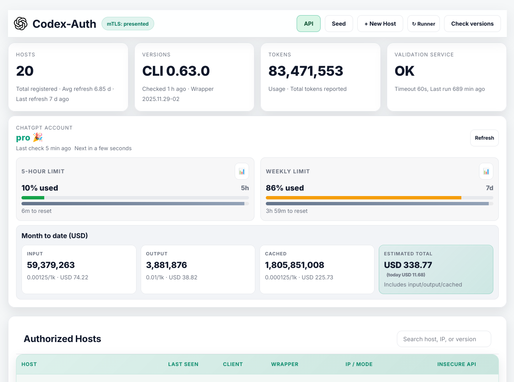
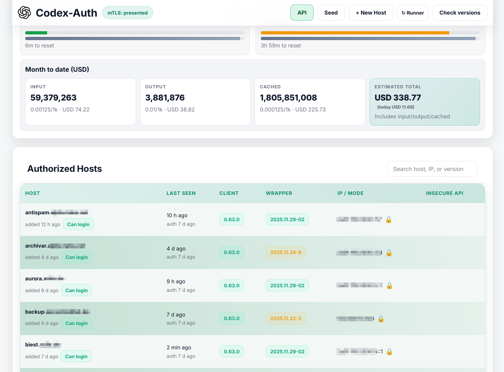
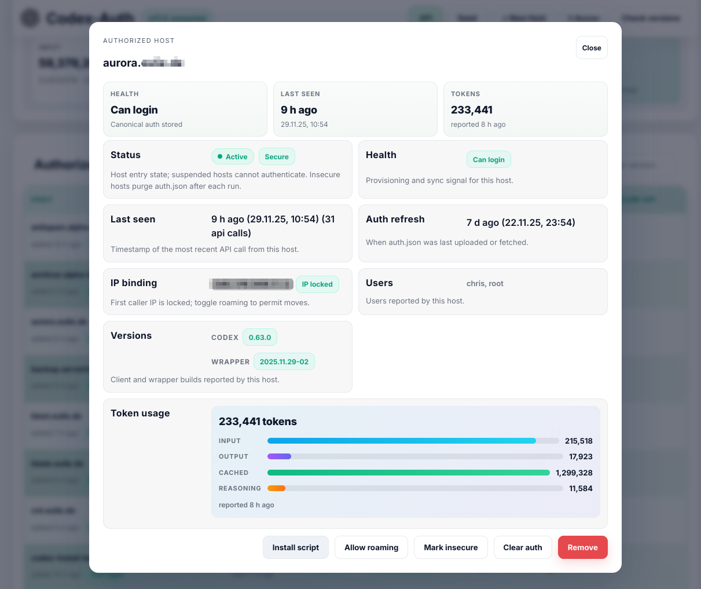

# Codex Auth Central API

> **Is this for you?**
> - You run Codex on multiple hosts and want a central `auth.json`.
> - You’re comfortable with Docker and TLS/mTLS.
> - You’re okay storing tokens and usage logs in MySQL.

🔒 Keep one canonical Codex `auth.json` for your whole fleet. 🚀 Mint per-host API keys from the dashboard, bake them into the `cdx` wrapper, and let hosts pull/push auth + usage with a single call.


## Why you might like it

- 🌐 One `/auth` flow to keep every host in sync (retrieve/store with version metadata).
- 🗝️ Per-host API keys, IP-bound on first contact; single-use installer tokens bake config into `cdx`.
- 📊 Auditing and usage: token usage rows plus per-request ingests (client IP + normalized payload), cost estimates from GPT‑5.1 pricing, versions, IPs, and runner validation logs.
- 🔒 Canonical auth + tokens encrypted at rest (libsodium).
- 🧠 Extras: slash-command distribution, MCP-compatible memories (store/retrieve/search across sessions), ChatGPT quota snapshots, and daily pricing pulls for cost dashboards.

## See it in action

- **Dashboard overview** — track host health, latest digests, versions, and API usage at a glance.
- **Host detail** — inspect canonical auth digests, recent validations, and roaming status per host.
- **Token usage** — visualize per-host token consumption (total/input/output/cached/reasoning) for billing or investigations.







## Get going fast

Use the installer to generate `.env`, secrets, and compose overrides, then start the stack. Full options live in `docs/INSTALL.md`.

```bash
bin/setup.sh                  # interactive; generates .env and config
docker compose up --build     # API on http://localhost:8488 with MySQL sidecar
```

Need TLS/mTLS via the bundled Caddy frontend? `bin/setup.sh --caddy ...` or see `docs/INSTALL.md` for examples.

## Usage & cost telemetry

- Send a single line or `usages: [...]` array to `/usage`; the API normalizes/sanitizes lines, attaches model-aware cost from the latest pricing snapshot, and stores both per-row entries (`token_usages`) and a per-request ingest envelope (`token_usage_ingests`) with aggregates + client IP.
- Admins can explore token rows at `/admin/usage`, ingest envelopes at `/admin/usage/ingests`, and cost/time trends (up to 180 days, pricing optional) at `/admin/usage/cost-history`.
- Pricing defaults to GPT‑5.1 and refreshes daily from `PRICING_URL` (or `GPT51_*`/`PRICING_CURRENCY` env fallbacks); missing pricing zeroes cost but still records usage.

## Contributing / local dev

- `composer install`
- `php -S localhost:8080 -t public`
- Ensure `storage/` is writable by PHP.

## Documentation

- Installation and deployment (including `bin/setup.sh`, TLS/mTLS, and Docker profiles): `docs/INSTALL.md`
- System overview, request flow, and operational notes: `docs/OVERVIEW.md`
- Human-friendly API surface overview: `docs/API.md`
- Source-of-truth interface contracts: `docs/interface-api.md`, `docs/interface-cdx.md`, `docs/interface-db.md`
- Auth runner behavior and probes: `docs/auth-runner.md`
- Security policy and hardening checklist: `docs/SECURITY.md`

## Codex instructions

`AGENTS.md` (repo root) remains a useful template, but the server now owns the canonical copy. Update it from the dashboard’s **AGENTS.md** panel; the API stores one version and every host pulls it into `~/.codex/AGENTS.md` on each run (removing stale local copies if the server copy is cleared). See the [Custom instructions with AGENTS.md guide](https://developers.openai.com/codex/guides/agents-md) for authoring tips.
