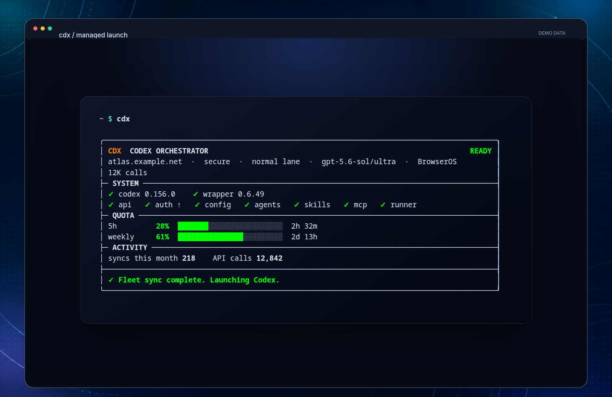
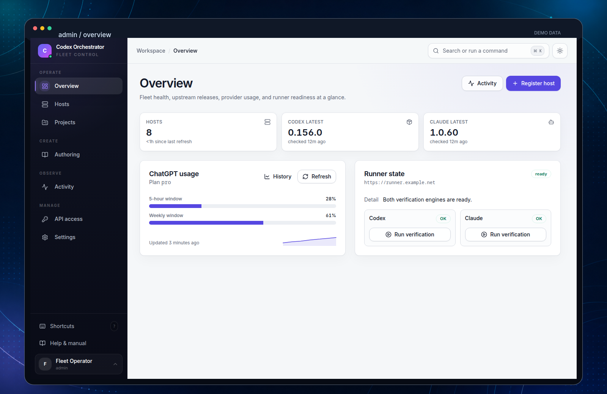
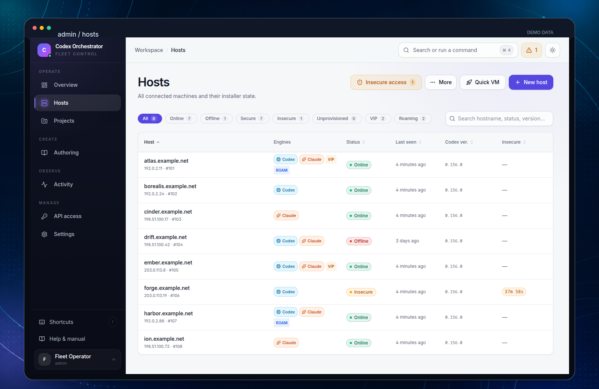
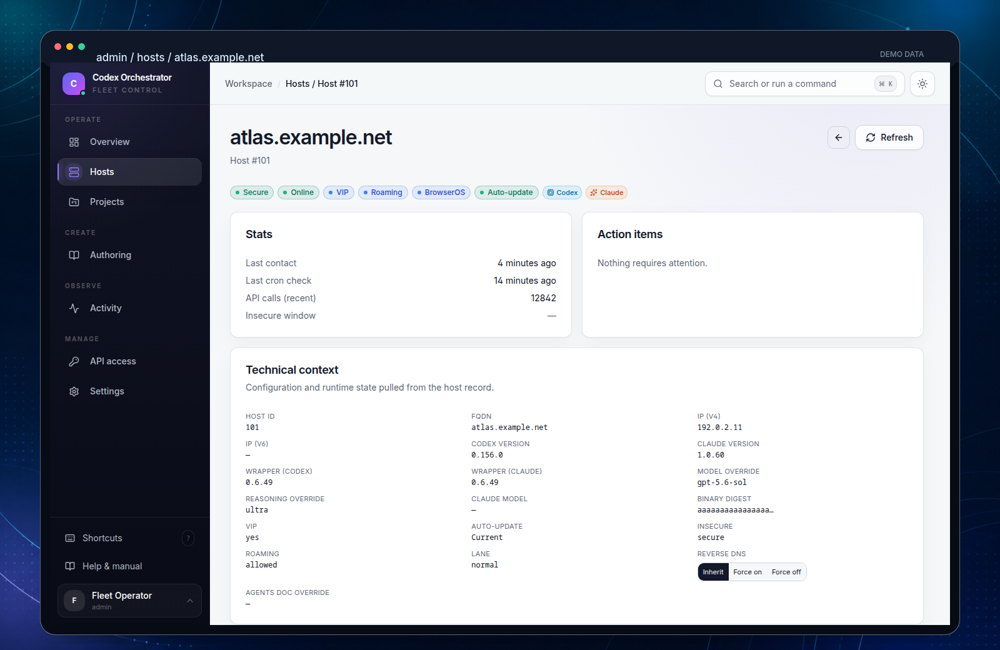
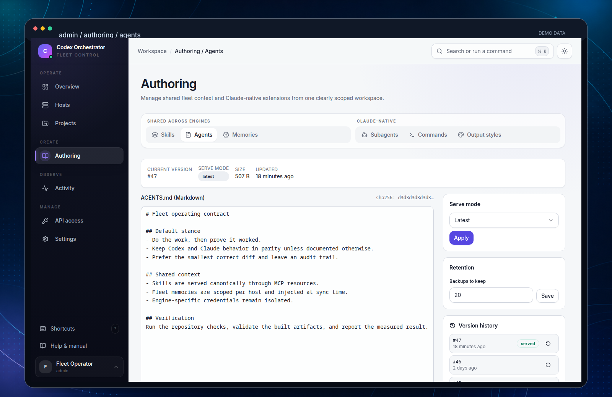
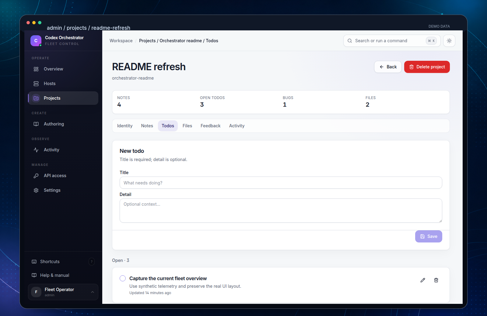
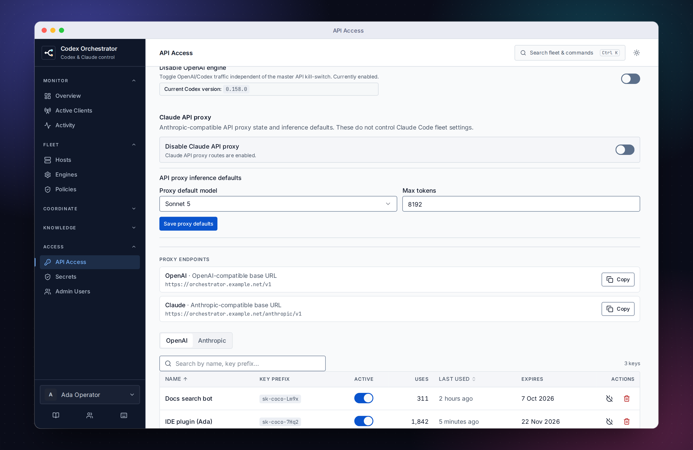

# Codex Orchestrator

**One command to rule your AI fleet — Codex and Claude, side by side.**

Codex Orchestrator is a self-hosted Node.js/MySQL service that keeps OpenAI Codex and Anthropic Claude Code running smoothly across every machine you own. Upload your auth once, register your hosts, and let `cdx` (Codex) and `clx` (Claude) handle the rest — syncing credentials, config, skills, and usage data while serving everything canonically through MCP so you never have to copy a token by hand again.

A host can run Codex, Claude, or both. The orchestrator manages both engines from a single admin dashboard.

> **Both engines are first-class.** `cdx` and `clx` are two personas of the same `cxx` wrapper binary, so auth, config, skills, agent documents, MCP, usage, and the safety controls are at parity across both — each delivered in its engine's native form. Claude Code arrived later, so a handful of surfaces stay engine-specific; the matrix below is the exact list. Please report anything that breaks.

[](docs/img/cdx-cli.png)

*`cdx` verifies fleet policy, auth, versions, quota, skills, and MCP before handing control to Codex.*

## What does it actually do?

**Multi-engine fleet management**
- Deploy **Codex** (`cdx`) and/or **Claude Code** (`clx`) on any host. Both entrypoints are relative aliases to one installed `cxx` wrapper binary and share the same host API key.
- Skills, AGENTS.md, and MCP memories are shared across both engines by default.
- Engine-specific config: `config.toml` for Codex, `settings.json` for Claude.

**Sync everything, everywhere**
- Auth credentials, config, slash commands, and agent documents stay in sync across every host — automatically, every time you run `cdx` or `clx`.
- Skills are served canonically through MCP `skill://{slug}` resources instead of per-host local copies.
- Each host gets its own API key in its signed engine config. No shared secrets floating around.

**Stay safe without thinking about it**
- Auth payloads are encrypted at rest. API keys are hashed and IP-bound on first use.
- Hosts you don't trust to keep credentials on disk? Mark them "insecure" — auth is purged after the last overlapping auth-aware wrapper process exits.
- A global kill switch lets you cut API access fleet-wide in seconds if something goes sideways.

**See what's happening**
- Track fleet health, sync activity, and ChatGPT quota windows with built-in dashboards.
- Quota warnings nudge you before you hit limits. VIP hosts can bypass them when it matters.
- ChatGPT quota snapshots refresh automatically so you always know where you stand.

**Stay in control**
- Pin Codex or Claude to a specific version fleet-wide, or let individual hosts override.
- The shared `cxx` wrapper self-updates from your server; `cdx` and `clx` retain their engine-specific CLI behavior through alias dispatch.
- An admin dashboard covers host management, engine selection, content editing, usage monitoring, and more.

**Expose compatible APIs**
- The built-in `/v1/` endpoints speak the OpenAI protocol — point any OpenAI SDK client at your orchestrator.
- The `/anthropic/v1/` endpoints speak the Anthropic protocol — point any Anthropic SDK client at your orchestrator.
- Manage API keys (`sk-coco-` prefix) from the admin dashboard with per-key rate limits and expiration.

**Collaborate across agents**
- The optional Projects module gives your agents shared notes, todos, files, and feedback with append-only change history.
- A native MCP server provides host-scoped memory tools plus shared project resources — accessible from both Codex and Claude.

## Codex vs Claude: feature matrix

Legend: ✅ supported · 🅱️ beta · — not supported

| Capability | Codex (`cdx`) | Claude (`clx`) |
|---|---|---|
| Daily-driver wrapper | ✅ | ✅ |
| Auth sync (account-login) | ✅ `auth.json` | ✅ native `claudeAiOauth` |
| Config sync | ✅ `config.toml` | ✅ `settings.json` (deep-merge, keeps your keys) |
| Per-host API key + IP binding | ✅ | ✅ |
| Wrapper self-update & version pinning | ✅ | ✅ |
| Shared skills | ✅ via MCP `skill://` | ✅ on-disk `~/.claude/skills/` |
| Agent doc sync | ✅ `AGENTS.md` | ✅ `CLAUDE.md` (shared pipeline) |
| MCP memory & project tools | ✅ | ✅ |
| Usage / token tracking | ✅ | ✅ |
| Insecure-host purge & kill switch | ✅ | ✅ |
| Compatible passthrough API | ✅ `/v1/` (OpenAI) | ✅ `/anthropic/v1/` (Anthropic) |
| ChatGPT quota snapshots & warnings | ✅ | — (native API limits only) |
| Lanes & profiles (`lane`, `profile`) | ✅ | — |
| Native collections (subagents / commands / output-styles) | — | ✅ |
| Advisor model (experimental reviewer) | — | 🅱️ `advisorModel` (opus/sonnet/haiku) |

The core fleet machinery — auth, config, per-host keys, skills, MCP memory, usage, and the safety controls — is at parity across both engines, because `cdx` and `clx` are personas of one `cxx` binary. Quota snapshots and lanes/profiles are Codex-only; Claude's native on-disk collections (subagents, commands, output-styles) have no Codex analogue. The one remaining 🅱️ row is the advisor model, which surfaces an experimental Claude Code feature and stays off unless you set it.

## Is this for me?

You'll get the most out of this if:

- You run Codex and/or Claude Code on **more than one machine** and want a single source of truth for auth and config.
- You want **per-host API keys** with IP binding, instead of one token pasted everywhere.
- You need **visibility** into who's using what across both engines, which hosts and engines are using tokens, and a way to set limits.
- You'd like to manage **skills and agent documents** from one place instead of scattering files across machines.
- You want a **kill switch** and quota controls you can pull from a dashboard.
- You want **OpenAI and Anthropic compatible APIs** you can point third-party tools at without exposing your real API keys.

If you only use one AI tool on one laptop, this is probably overkill — but we won't judge if you set it up anyway.

## Get started in 5 minutes

All you need is Docker with the Compose v2 plugin, plus `curl` and `openssl`.

```bash
bin/install.sh
```

That's it. The guided installer walks twelve steps: it generates every
installation-owned secret, wires TLS, builds a four-platform `cxx` fleet trusted
only by this installation, provisions the database schema, starts the stack,
creates your first owner, and verifies readiness. It prints `READY` and the
console URL only after every critical check passes; anything short of that prints
`INCOMPLETE` and exits non-zero.

Every step is re-runnable, so an interrupted install resumes rather than starting
over. `bin/install.sh doctor` diagnoses an existing one and names the command
that fixes each problem.

Driving it from a script or an agent:

```bash
bin/install.sh --json --non-interactive \
  --url https://codex.example.com --tls acme --acme-email ops@example.com \
  --admin-name "Ada Lovelace" --admin-user ada --admin-email ada@example.com \
  --admin-pass-file /run/secrets/owner-password
```

One JSON object per step on stdout, human output on stderr. See
[`docs/INSTALL.md`](docs/INSTALL.md) for every flag and for staged-deployment
options.

### Onboard your first host

1. **Create the first owner** — `bin/install.sh` does this for you. If you skipped it, open the `/admin/setup` URL it printed. The unclaimed owner endpoint is intentionally public only while no admin exists, so do not expose an unclaimed installation.
2. **Upload your auth** — follow the persistent setup checklist to seed canonical Codex and/or Claude credentials. You only do this once per configured engine.
3. **Register a host** — Admin, Hosts, New Host. You'll get an installer command.
4. **Run the installer** on the target machine:
   ```bash
   curl https://your-server/install/<token> | bash
   ```
5. **Done.** The checklist clears after the first successful sync. Codex hosts run `cdx`, Claude hosts run `clx`, and dual-engine hosts get both aliases backed by one `cxx` install.

Secure hosts keep auth on disk and work offline (24h fresh window, 7d fallback).
On insecure hosts, every auth-aware cdx/clx invocation shares a session lease;
the last exiting process purges native credentials while preserving explicit
logout intent. An open admin window is required for the next retrieve.

## See it in action

All screenshots use documentation-safe demo data. Click any image for the full-resolution view.

### Fleet state at a glance

[](docs/img/fleet-overview.png)

*See fleet health, upstream releases, quota pressure, and both verification runners without tab hunting.*

### Every host, one control plane

[](docs/img/host-inventory.png)

*Search and filter the fleet while engine coverage, sync health, version drift, and trust state remain visible.*

### One machine, all the context

[](docs/img/host-detail.png)

*Inspect auth drift, versions, model overrides, IP policy, engines, and lifecycle controls from one page.*

### Author once. Serve everywhere.

[](docs/img/authoring-agents.png)

*Version shared fleet instructions, choose exactly what is served, and manage cross-engine context from one workspace.*

### Shared context for both engines

[](docs/img/project-workspace.png)

*Give Codex and Claude the same notes, todos, files, feedback, and append-only activity trail.*

### Compatible APIs, scoped credentials

[](docs/img/api-access.png)

*Copy either compatible base URL, gate each proxy independently, and issue revocable, expiring, rate-limited keys.*

## Day-to-day: the `cdx` command

Once a host is provisioned, `cdx` is your daily driver:

```bash
cdx                              # sync and launch with fleet defaults
cdx myprofile                    # use a named profile from config.toml
cdx --execute "show me open PRs" # one-shot, script-friendly output
```

A few more handy ones:

```bash
cdx status          # quick health check
cdx doctor          # diagnose SSH, PTY, and API issues
cdx auth-upload     # upload current ~/.codex/auth.json after codex login
cdx lane spark      # switch to Spark lane for this run
cdx ls              # shortcut for lane spark
cdx --update        # force-update the wrapper and Codex
cdx --uninstall     # remove everything and decommission
```

## OpenAI-compatible API

The orchestrator exposes an OpenAI-compatible REST API at `/v1/`. Any tool that speaks the OpenAI protocol (SDKs, CLI clients, IDE plugins) can use it.

1. **Create a key** in Admin > API access.
2. **Point your client** at the orchestrator:
   ```python
   import openai
   client = openai.OpenAI(
       base_url="https://your-server/v1",
       api_key="sk-coco-...",
   )
   response = client.chat.completions.create(
       model="cdx-lm-1",
       messages=[{"role": "user", "content": "Hello!"}],
   )
   ```

Supported endpoints: `/v1/chat/completions`, `/v1/completions`, `/v1/models`. Embeddings returns a `not_implemented` error. Streaming (`stream: true`) sends a single SSE frame with the full response.

## Under the hood

Codex Orchestrator takes security seriously so you can focus on building things:

- **Encryption**: All auth payloads use libsodium secretbox. Keys are rotated with KID tracking.
- **Runner validation**: A sidecar service validates auth before writes are accepted — transparent to reads.
- **Rate limiting**: All non-admin routes are rate-limited, with a dedicated bucket for auth failures.
- **Session-gated admin**: `/admin/*` is protected by the admin session cookie. Passkey (WebAuthn) login is available too. This server issues and verifies no certificates of its own; a proxy in front may terminate mTLS and forward `X-MTLS-*`, which the API reads from trusted peers only.
- **IP binding**: Each host's API key locks to its IP on first use, with optional roaming support.

For the full API surface, MCP details, and architecture deep-dive, check the docs below.

## Memory management

Memory is split into three intentional scopes so scratch notes, workstream facts,
and fleet knowledge do not blur together:

- **Host** — host-local scratch through `memory_*` / `memory://`; isolated per
  host.
- **Project** — short durable facts for one workstream through
  `project_memory_*` / `project://{slug}/memory/{key}`; discoverable by every
  host participating in that project.
- **Shared** — fleet-wide reference documents through `shared_memory_*` /
  `shared://{slug}`; chunked, full-text indexed, and safe for concurrent append.
- **Memory Atlas** — `/admin/authoring/memories` visualizes all three stores as
  an explicit relationship graph or accessible list, with search and scope,
  host, project, tag, and engine filters. Its inspector supports create, read,
  edit, shared append, permanent delete, and retention-bound operational
  activity. Updates and deletes use ETags so stale edits fail with a conflict
  instead of silently overwriting newer state; only owner/admin accounts can
  mutate memories. The canvas stays bounded to the newest 150 memories from a
  loaded page while the synchronized list retains the complete page.

## Skill management

Skills are stored centrally and delivered in each engine's native form — no manual copying between machines.

- **Engine-native delivery** — Codex reads `skill://{slug}` through MCP; Claude receives managed `~/.claude/skills/<slug>/` directories during bootstrap. The wrapper cleans up obsolete mirrors without touching user-owned Claude Skills.
- **Admin authoring** — create, edit, and delete skills from `/admin/skills`. Descriptions and drafts can be AI-generated via the runner.
- **Integrity tracking** — every skill carries a SHA256 hash so the sync pipeline knows when content has actually changed.
- **MCP-first Codex routing** — when the managed MCP is usable, the baked Codex config disables the built-in local `skill-creator`; served AGENTS guidance uses `skill_list` first for fleet-Skill requests and routes management requests and workflow questions to `skill://skill-manager`, without reordering higher-level runtime requirements for built-in/system Skills. Claude continues to use its native synced Skill directories.

## Dynamic AGENTS.md and CLAUDE.md

The agent document is version-controlled on the server as canonical base Markdown and assembled for each engine and host at sync time.

- **Versioned** — every save creates a new immutable version. The admin can revert to any previous version or lock serving to a specific one.
- **Serve modes** — `latest` always serves the newest version; `locked` pins to a chosen version. Per-host overrides are supported.
- **Dynamic feature guidance** — one block delimited by `<!-- cxx:managed-features:start -->` and `<!-- cxx:managed-features:end -->` adds only the concise hints that apply: authoritative MCP-first fleet-Skill discovery, MCP memory routing, Projects/CoCo, Codex-only BrowserOS, and the fleet secrets workflow. Codex consults `skill_list` before host-local copies for fleet-Skill work and reads `skill://skill-manager` for management; Claude receives native Skill-path wording. Memory records are authoritative for recorded decisions and handoffs, while mutable code/runtime facts still require current verification. Replacing an existing shared-memory document requires an offset-zero complete read with one stable digest so partial windows cannot amputate it. Secret values may be written to an explicitly requested task destination; the guidance still prefers tool-native parameters, stdin, inherited descriptors, or process-scoped environment variables. BrowserOS appears only for Codex hosts with both the host toggle and orchestrator MCP enabled. Canonical inventories are never embedded in the document.
- **Change detection** — the wrapper sends its local SHA256; the server responds with `unchanged` (skip write) or `updated` (atomic file replace). Three hashes are tracked: base document, managed sections, and final combined.
- **Seeded on boot** — if the database is empty, the server seeds from the repo's `AGENTS.md` file on first start.
- **Admin dashboard** — edit the canonical base, view version history, and control serve mode at `/admin/agents`; host-specific hints are appended only when the document is served.

## Documentation

| Doc | What's inside |
|-----|---------------|
| [`INSTALL.md`](docs/INSTALL.md) | Install wizard, Docker services, TLS, backups |
| [`USAGE.md`](docs/USAGE.md) | Host user and operator workflows |
| [`OVERVIEW.md`](docs/OVERVIEW.md) | Architecture, auth flow, sync pipeline |
| [`API.md`](docs/API.md) | Full HTTP API reference |
| [`MCP.md`](docs/MCP.md) | MCP server tools and resources |
| [`CONFIG_BUILDER.md`](docs/CONFIG_BUILDER.md) | Fleet config.toml builder |
| [`ADMIN.md`](docs/ADMIN.md) | Admin dashboard guide |
| [`interface-api.md`](docs/interface-api.md) | API interface contracts |
| [`interface-db.md`](docs/interface-db.md) | Database schema reference |
| [`interface-cdx.md`](docs/interface-cdx.md) | Wrapper interface contracts |

## License

[GNU General Public License v3](LICENSE)
