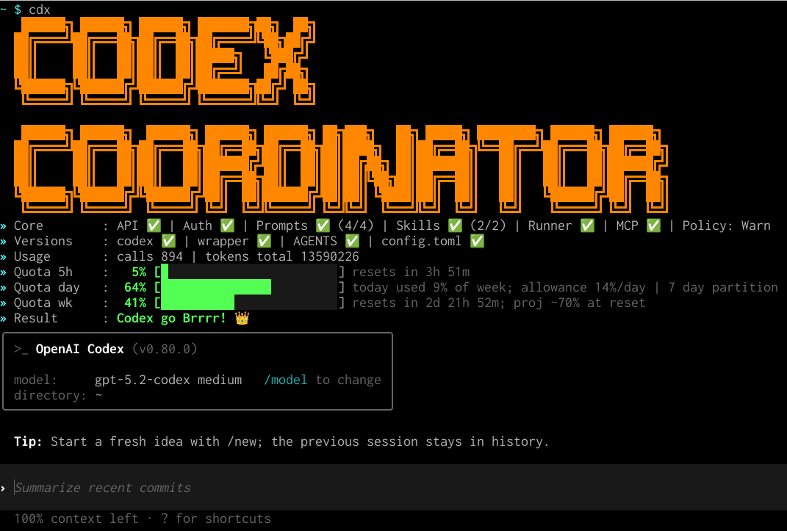
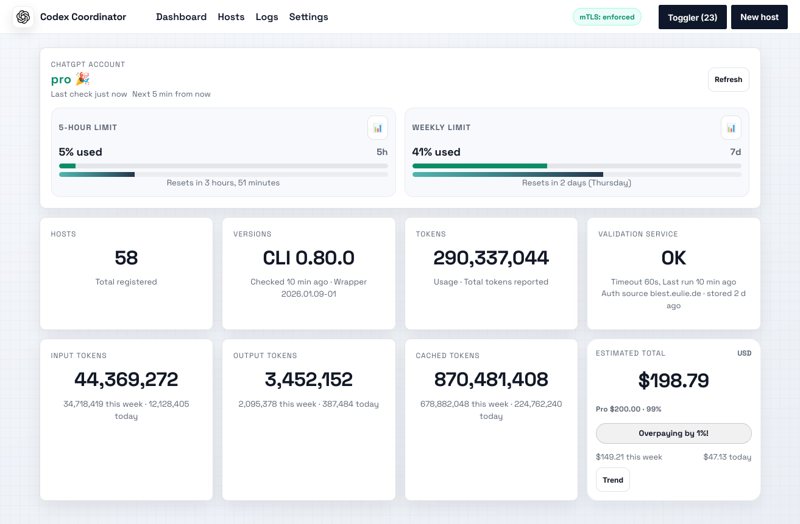
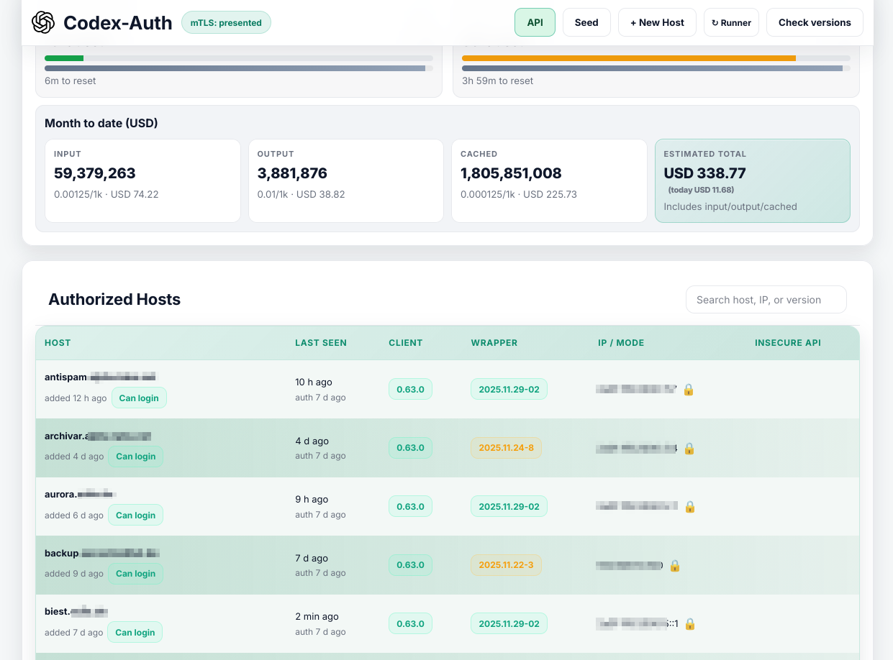
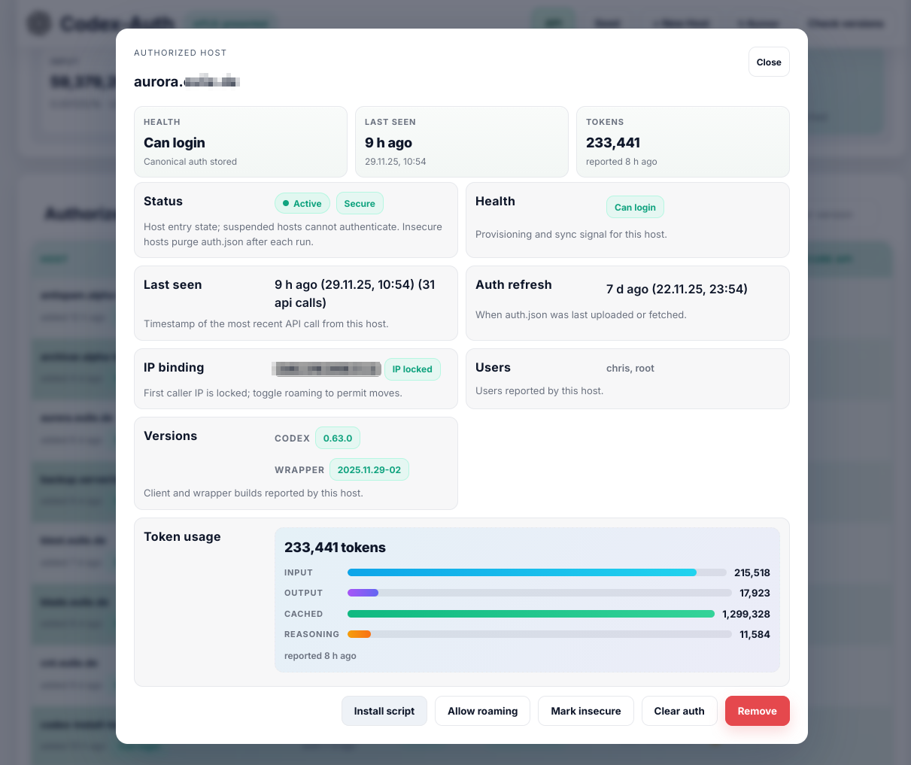

# Codex Orchestrator

**One command to rule your AI fleet — Codex and Claude, side by side.**

Codex Orchestrator is a self-hosted PHP/MySQL service that keeps OpenAI Codex and Anthropic Claude Code running smoothly across every machine you own. Upload your auth once, register your hosts, and let `cdx` (Codex) and `clx` (Claude) handle the rest — syncing credentials, config, skills, and usage data while serving everything canonically through MCP so you never have to copy a token by hand again.

A host can run Codex, Claude, or both. The orchestrator manages both engines from a single admin dashboard.



## What does it actually do?

**Multi-engine fleet management**
- Deploy **Codex** (`cdx`) and/or **Claude Code** (`clx`) on any host — each gets its own wrapper but shares the same API key.
- Skills, AGENTS.md, and MCP memories are shared across both engines by default.
- Engine-specific config: `config.toml` for Codex, `settings.json` for Claude.

**Sync everything, everywhere**
- Auth credentials, config, slash commands, and agent documents stay in sync across every host — automatically, every time you run `cdx` or `clx`.
- Skills are served canonically through MCP `skill://{slug}` resources instead of per-host local copies.
- Each host gets its own API key baked right into the wrapper. No shared secrets floating around.

**Stay safe without thinking about it**
- Auth payloads are encrypted at rest. API keys are hashed and IP-bound on first use.
- Hosts you don't trust to keep credentials on disk? Mark them "insecure" — auth gets purged after every run.
- A global kill switch lets you cut API access fleet-wide in seconds if something goes sideways.

**See what's happening**
- Track token usage and costs per host and per engine with built-in dashboards.
- Quota warnings nudge you before you hit limits. VIP hosts can bypass them when it matters.
- ChatGPT quota snapshots refresh automatically so you always know where you stand.
- Claude model pricing (Opus, Sonnet, Haiku) tracked alongside Codex/GPT costs.

**Stay in control**
- Pin Codex or Claude to a specific version fleet-wide, or let individual hosts override.
- Both `cdx` and `clx` wrappers self-update from your server — no manual upgrades.
- An admin dashboard covers host management, engine selection, content editing, usage monitoring, and more.

**Expose compatible APIs**
- The built-in `/v1/` endpoints speak the OpenAI protocol — point any OpenAI SDK client at your orchestrator.
- The `/anthropic/v1/` endpoints speak the Anthropic protocol — point any Anthropic SDK client at your orchestrator.
- Manage API keys (`sk-coco-` prefix) from the admin dashboard with per-key rate limits and expiration.

**Collaborate across agents**
- The optional Projects module gives your agents shared notes, todos, files, and feedback with append-only change history.
- A native MCP server provides host-scoped memory tools plus shared project resources — accessible from both Codex and Claude.

## Is this for me?

You'll get the most out of this if:

- You run Codex and/or Claude Code on **more than one machine** and want a single source of truth for auth and config.
- You want **per-host API keys** with IP binding, instead of one token pasted everywhere.
- You need **visibility** into who's using what across both engines, how much it costs, and a way to set limits.
- You'd like to manage **skills and agent documents** from one place instead of scattering files across machines.
- You want a **kill switch** and quota controls you can pull from a dashboard.
- You want **OpenAI and Anthropic compatible APIs** you can point third-party tools at without exposing your real API keys.

If you only use one AI tool on one laptop, this is probably overkill — but we won't judge if you set it up anyway.

## Get started in 5 minutes

All you need is Docker and Docker Compose.

```bash
bin/setup.sh
```

That's it. The guided installer walks you through `.env` configuration, data directories, TLS setup, and (unless you opt out) builds and starts the whole stack. See [`docs/INSTALL.md`](docs/INSTALL.md) for non-interactive flags and advanced options.

### Onboard your first host

1. **Upload your auth** — go to Admin and upload your canonical `~/.codex/auth.json`. You only do this once.
2. **Register a host** — Admin, Hosts, New Host. You'll get an installer command.
3. **Run the installer** on the target machine:
   ```bash
   curl https://your-server/install/<token> | bash
   ```
4. **Done.** From now on, just run `cdx` and everything syncs.

Secure hosts keep auth on disk and work offline (24h fresh window, 7d fallback). Insecure hosts purge auth after each run and need an open window from the admin.

## See it in action





## Day-to-day: the `cdx` command

Once a host is provisioned, `cdx` is your daily driver:

```bash
cdx                              # sync and launch with fleet defaults
cdx myprofile                    # use a named profile from config.toml
cdx --execute "show me open PRs" # one-shot, script-friendly output
```

A few more handy ones:

```bash
cdx status          # quick health check
cdx doctor          # diagnose SSH, PTY, and API issues
cdx lane spark      # switch to Spark lane for this run
cdx ls              # shortcut for lane spark
cdx --update        # force-update the wrapper and Codex
cdx --uninstall     # remove everything and decommission
```

## OpenAI-compatible API

The orchestrator exposes an OpenAI-compatible REST API at `/v1/`. Any tool that speaks the OpenAI protocol (SDKs, CLI clients, IDE plugins) can use it.

1. **Create a key** in Admin > Settings > API Keys.
2. **Point your client** at the orchestrator:
   ```python
   import openai
   client = openai.OpenAI(
       base_url="https://your-server/v1",
       api_key="sk-coco-...",
   )
   response = client.chat.completions.create(
       model="cdx-lm-1",
       messages=[{"role": "user", "content": "Hello!"}],
   )
   ```

Supported endpoints: `/v1/chat/completions`, `/v1/completions`, `/v1/models`. Embeddings returns a `not_implemented` error. Streaming (`stream: true`) sends a single SSE frame with the full response.

## Under the hood

Codex Orchestrator takes security seriously so you can focus on building things:

- **Encryption**: All auth payloads use libsodium secretbox. Keys are rotated with KID tracking.
- **Runner validation**: A sidecar service validates auth before writes are accepted — transparent to reads.
- **Rate limiting**: All non-admin routes are rate-limited, with a dedicated bucket for auth failures.
- **mTLS admin access**: The admin API defaults to mutual TLS. Passkey (WebAuthn) login is available too.
- **IP binding**: Each host's API key locks to its IP on first use, with optional roaming support.

For the full API surface, MCP details, and architecture deep-dive, check the docs below.

## Memory management

Every host gets its own scoped memory store, exposed through MCP tools so agents can persist and recall knowledge across sessions.

- **Store, search, retrieve** — agents use `memory_store`, `memory_search`, and `memory_retrieve` MCP tools. Content is full-text indexed and taggable.
- **Scoped by host** — each host's memories are isolated. Admins can search across all hosts from the dashboard.
- **Auto-summarized** — when a memory changes, the runner generates a one-line summary so agents can scan what's available without reading every entry.
- **Injected into AGENTS.md** — recent memories (up to 50) are dynamically injected into each host's synced AGENTS.md, giving agents instant context on what they've previously stored.
- **Admin dashboard** — browse, search, and delete memories at `/admin/mcp/memories`.

## Skill management

Skills are slash-command manifests stored centrally and served canonically through MCP — no more copying files between machines.

- **Canonical via MCP** — agents access skills through `skill://{slug}` resources. The wrapper cleans up legacy per-host skill directories automatically.
- **Admin authoring** — create, edit, and delete skills from `/admin/skills`. Descriptions and drafts can be AI-generated via the runner.
- **Integrity tracking** — every skill carries a SHA256 hash so the sync pipeline knows when content has actually changed.
- **Injected into AGENTS.md** — published skills with their descriptions are listed in a dynamic section inside each host's AGENTS.md, so agents always know what's available.

## Dynamic AGENTS.md

AGENTS.md is version-controlled on the server and dynamically assembled at sync time with injected sections for skills and memories.

- **Versioned** — every save creates a new immutable version. The admin can revert to any previous version or lock serving to a specific one.
- **Serve modes** — `latest` always serves the newest version; `locked` pins to a chosen version. Per-host overrides are supported.
- **Dynamic injection** — when a host pulls AGENTS.md, the server splices in two managed sections (wrapped in `<!-- cdx:skills:start/end -->` and `<!-- cdx:memories:start/end -->` markers):
  - A **Skills** listing of all published skill slugs and descriptions.
  - A **Memories** listing of recent host-scoped memories with summaries.
- **Change detection** — the wrapper sends its local SHA256; the server responds with `unchanged` (skip write) or `updated` (atomic file replace). Three hashes are tracked: base document, managed sections, and final combined.
- **Seeded on boot** — if the database is empty, the server seeds from the repo's `AGENTS.md` file on first start.
- **Admin dashboard** — edit inline, view version history, control serve mode, and preview the fully rendered document with injections at `/admin/agents`.

## Documentation

| Doc | What's inside |
|-----|---------------|
| [`INSTALL.md`](docs/INSTALL.md) | Setup, Docker services, TLS, mTLS, backups |
| [`USAGE.md`](docs/USAGE.md) | Host user and operator workflows |
| [`OVERVIEW.md`](docs/OVERVIEW.md) | Architecture, auth flow, sync pipeline |
| [`API.md`](docs/API.md) | Full HTTP API reference |
| [`MCP.md`](docs/MCP.md) | MCP server tools and resources |
| [`CONFIG_BUILDER.md`](docs/CONFIG_BUILDER.md) | Fleet config.toml builder |
| [`ADMIN.md`](docs/ADMIN.md) | Admin dashboard guide |
| [`DESIGN.md`](DESIGN.md) | OpenAI-compatible API design |
| [`interface-api.md`](docs/interface-api.md) | API interface contracts |
| [`interface-db.md`](docs/interface-db.md) | Database schema reference |
| [`interface-cdx.md`](docs/interface-cdx.md) | Wrapper interface contracts |

## License

[GNU General Public License v3](LICENSE)
