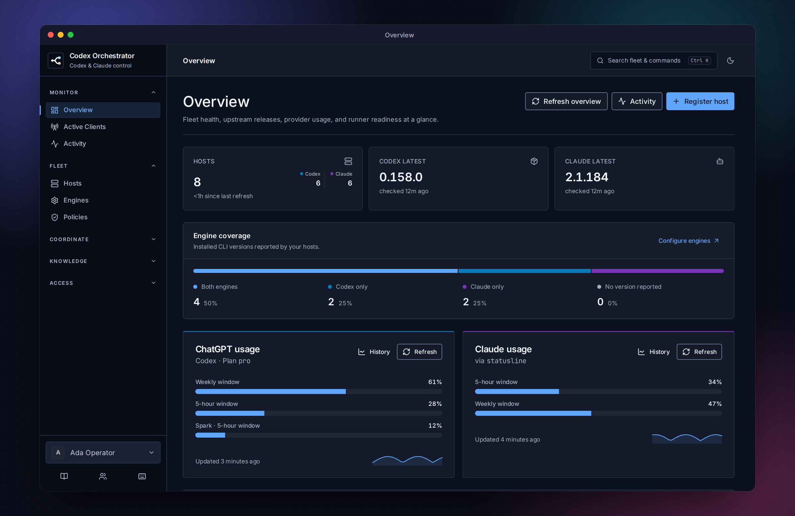
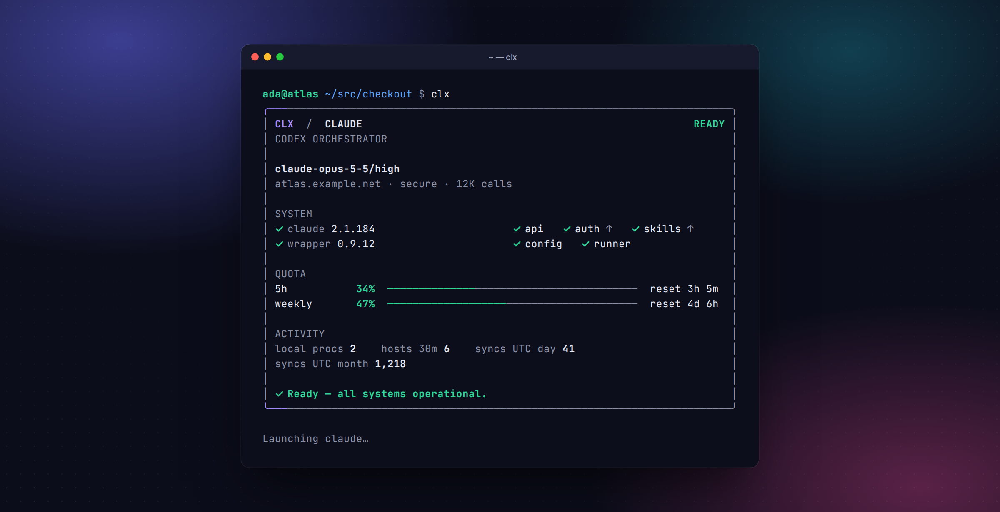
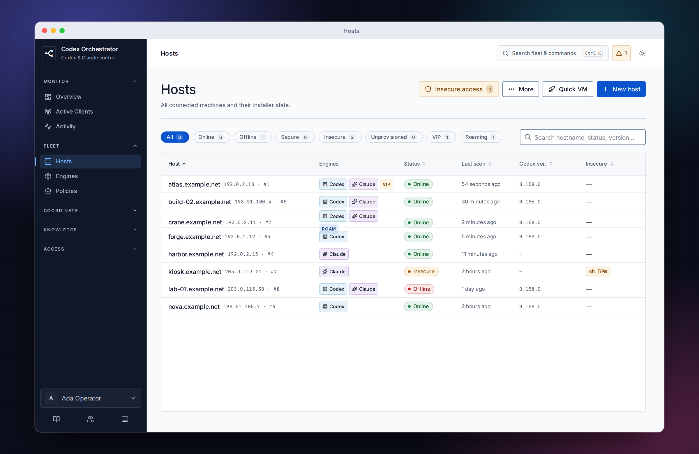
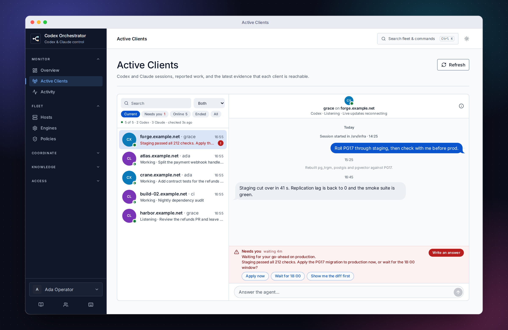
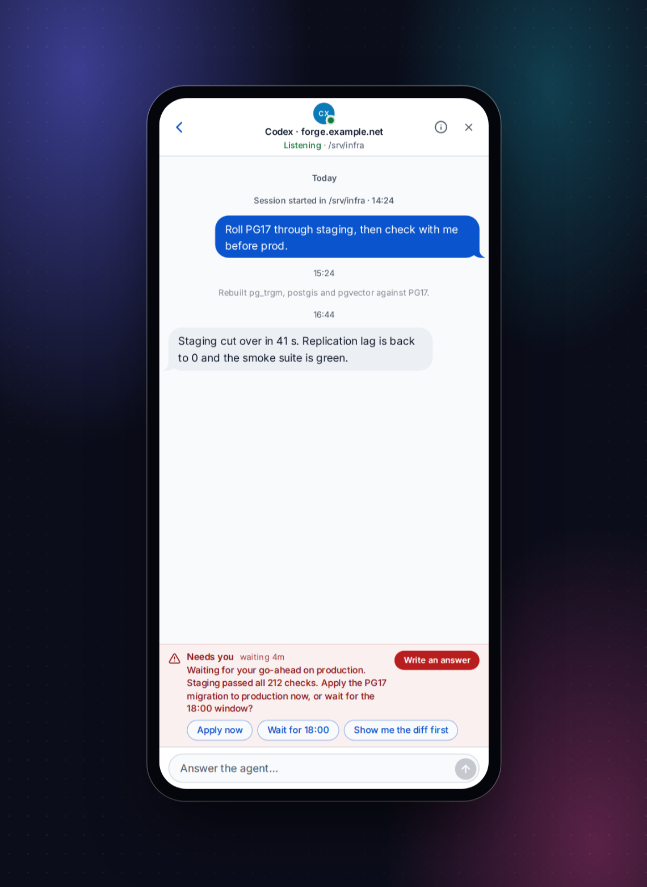
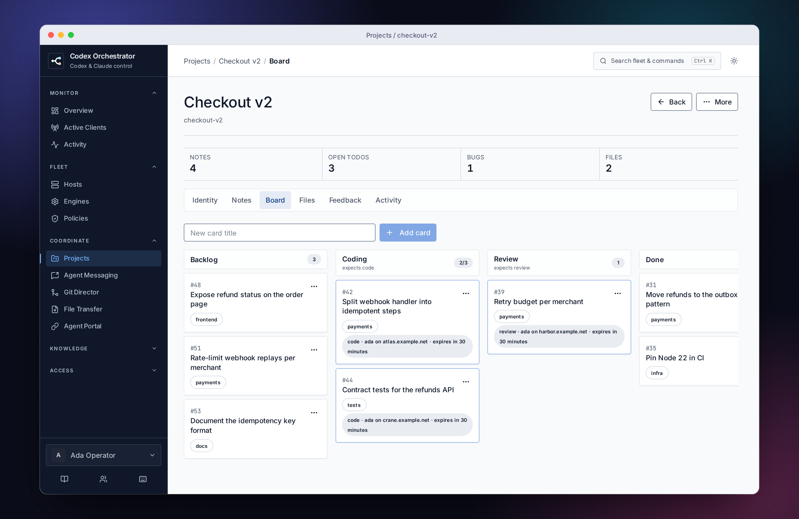
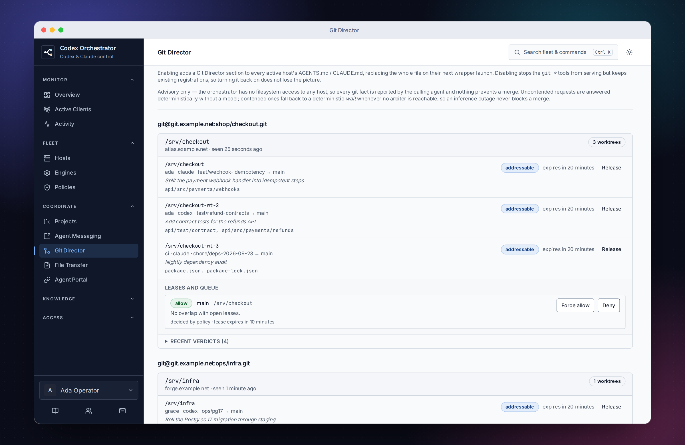
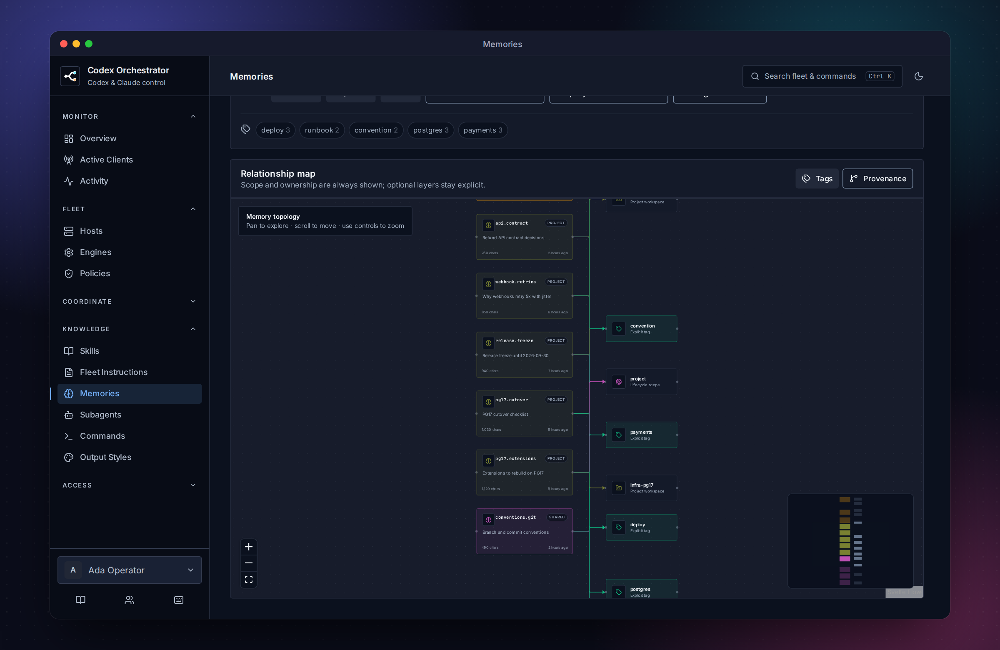
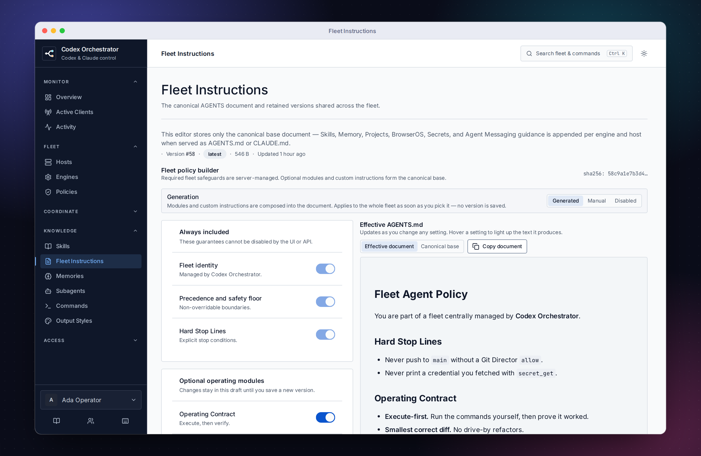

<h1 align="center">Codex Orchestrator</h1>

<p align="center">
  <strong>Your AI coding agents, all on one control plane.</strong><br>
  Self-hosted fleet management for <b>OpenAI Codex</b> and <b>Anthropic Claude Code</b>, side by side.
</p>

<p align="center">
  <a href="#get-started-in-5-minutes">Quickstart</a> ·
  <a href="#the-tour">Tour</a> ·
  <a href="#codex-vs-claude-at-a-glance">Engine matrix</a> ·
  <a href="#day-to-day-cdx-and-clx">Commands</a> ·
  <a href="#documentation">Docs</a>
</p>

<p align="center">
  <picture>
    <source media="(prefers-color-scheme: dark)" srcset="docs/img/overview.png">
    <source media="(prefers-color-scheme: light)" srcset="docs/img/overview-light.png">
    
  </picture>
</p>

You run Codex on your laptop, Claude Code on the build box, both on the
workstation under your desk, and somewhere along the way you pasted the same
token into six different `auth.json` files. Your agents are brilliant, and they
have no idea the others exist.

Codex Orchestrator fixes both halves of that. It is a self-hosted
Node.js + MySQL control plane: upload your credentials once, register your
hosts, and let `cdx` (Codex) and `clx` (Claude) keep every machine in sync —
auth, config, skills, and agent instructions. A built-in MCP server then gives
every agent in the fleet shared memory, a project board, merge arbitration,
peer messaging, secrets, and a file drop. You stop copying tokens by hand, and
your agents start working as a team.

> [!NOTE]
> **Both engines are first-class.** `cdx` and `clx` are two personas of one
> `cxx` wrapper binary, so auth, config, skills, agent documents, MCP, usage,
> messaging, and the safety controls are at parity — each delivered in its
> engine's native form. [The matrix](#codex-vs-claude-at-a-glance) lists
> exactly what differs. If something breaks, please report it.

---

## Is this for you?

You'll feel right at home if you:

- 🖥️ run Codex and/or Claude Code on **more than one machine** and want one source of truth for auth and config;
- 🤝 run **more than one agent at a time** and want them to share memory, split work on a board, and not trample each other's merges;
- 🔑 want **per-host API keys** with IP binding instead of one token pasted everywhere;
- 📊 need to see **who is burning which tokens**, what every agent is doing right now, and where the limits are;
- 📚 would rather manage **skills and agent instructions** in one place than scatter files across machines;
- 🧯 want a **kill switch**, an approval queue, and quota controls you can pull from a dashboard — or your phone;
- 🔌 want **OpenAI- and Anthropic-compatible APIs** for third-party tools, without handing out your real keys.

If you use one AI tool on one laptop, this is probably overkill. We won't judge
if you set it up anyway.

---

## The tour

### Every launch is a health check

<p align="center">
  
  
</p>

Type `cdx` or `clx` and the wrapper converges the host before the engine
starts — one `POST /sync/bootstrap` round-trip, then straight in.

- **Auth, config, skills, and agent instructions** land on every host each time you launch.
- **Engine-native config**: `config.toml` for Codex (written wholesale), `settings.json` for Claude (deep-merged, so your own keys survive).
- **Signed per-host config**: each host gets its own Ed25519-signed config carrying its own API key. No shared secrets floating around.
- **Quiet upgrades**: engine upgrades install in the background on a 15-minute schedule into private prefixes and switch over atomically. Launches never wait on npm.

*Both screens above are the wrapper's real renderer, fed demo data.*

### Your whole fleet, one table



A host can run Codex, Claude, or both, and one console manages both engines.
Filter by online, secure, insecure, VIP, or roaming; spot version drift at a
glance; and open any host to adjust its lane, model, version pin, IP policy, or
lifecycle.

- **Pin versions** of Codex or Claude fleet-wide, or let individual hosts override.
- **Graduated policy profiles** set a security posture per host (what an agent may do without asking).
- **Insecure hosts** — machines you don't trust with credentials on disk — get their auth purged after the last wrapper exits, and need an approval to come back.

### See what every agent is doing



**Active Clients** lists every running `cdx`/`clx` session in the fleet:
presence, current task, Git Director branch, messaging address, and a
one-click force close. When an agent needs a decision, it floats to the top
under **Needs you** — with the question and its answer buttons right there.

### Answer your agents from your phone

<p align="center">
  
</p>

The **Agent Portal** (`/go`) is a mobile-friendly page where a running agent
reports progress, asks you questions, and takes instructions — through a
permanent magic link or your console login. Turn on `#afk` before you walk
away and the agent keeps working, raising a **Needs you** banner only when it
actually needs a human.

### Agents that work as a team



Every host reaches the orchestrator's MCP server, and both engines get the same tools:

- **Projects / CoCo** — shared notes, files, feedback, project memory, and a **Kanban board** whose cards agents *claim with a lease*, so two agents never pick up the same work.
- **Agent Messaging** — an encrypted, ordered, at-least-once bus between Codex and Claude agents on any host, plus live two-party `#call` sessions and chaired `#conference` rooms.
- **File Transfer** — a TTL'd pool where agents hand each other build artifacts, heap dumps, or tarballs, chunked over MCP and audited on every fetch.
- **Secrets** — working credentials (GitHub tokens, database passwords, service keys) delivered over MCP on demand, never written to disk by the orchestrator, every read audited.

### Merges without the mid-air collisions



**Git Director** is the fleet's merge air-traffic control. Agents register the
clone they're working in and the paths they expect to touch, then ask before
merging into a shared branch. Verdicts are `allow`, `wait`, or `deny` — decided
by policy, by a model, or by you from the console — with the overlapping files
named so the waiting agent knows exactly why.

### A memory that outlives the session



Memory comes in three deliberate scopes — host scratch, per-project facts, and
fleet-wide shared documents — and the **Memory Atlas** draws all of them as one
relationship graph you can search and filter by scope, host, project, tag, or
engine. [More on memory below.](#memory-three-scopes-one-atlas)

### Write the rules once



Author skills, fleet instructions, Claude subagents, commands, and output
styles once; serve them everywhere. The policy builder composes the canonical
`AGENTS.md` / `CLAUDE.md` from modules, and the preview shows the exact
document any host will receive — including one concise guidance block per
enabled feature, so agents learn the house rules without you writing them
twice. [How the document is assembled.](#dynamic-agentsmd-and-claudemd)

### Point any SDK at it


- `/v1/` speaks the **OpenAI** protocol; `/anthropic/v1/` speaks the **Anthropic** protocol.
- Revocable, expiring `sk-coco-` keys, with each lane switchable independently.
- [Code samples below.](#compatible-apis)

### Safe by default, not by discipline

- 🔒 Auth payloads and every secret column are **encrypted at rest** with libsodium secretbox; keys rotate with KID tracking.
- 🧷 API keys are **hashed and IP-bound** on first use. A sidecar runner **verifies credentials** before they're accepted.
- 🚪 **Insecure hosts** need an approval — per host, per domain, or fleet-wide while you're at your desk.
- 👥 **Six console roles** behind a default-deny capability matrix, **passkey (WebAuthn)** login, and a **global kill switch** that cuts host access fleet-wide in seconds.
- 📈 **Quota warnings** nudge you before you hit limits (VIP hosts can bypass them when it matters), and an **audit trail** plus MCP request log records everything hosts and operators do.

---

## Codex vs Claude at a glance

Legend: ✅ supported · 🅱️ beta · — not supported

| Capability | Codex (`cdx`) | Claude (`clx`) |
|---|---|---|
| Daily-driver wrapper | ✅ | ✅ |
| Auth sync (account login) | ✅ `auth.json` | ✅ native `claudeAiOauth` |
| Config sync | ✅ `config.toml` | ✅ `settings.json` (deep-merge, keeps your keys) |
| Per-host API key + signed config | ✅ | ✅ |
| Wrapper self-update & version pinning | ✅ | ✅ |
| Background engine upgrades | ✅ | ✅ |
| Shared skills | ✅ via MCP `skill://` | ✅ on-disk `~/.claude/skills/` |
| Agent doc sync | ✅ `AGENTS.md` | ✅ `CLAUDE.md` (shared pipeline) |
| MCP memory, projects, board, secrets | ✅ | ✅ |
| Git Director & File Transfer | ✅ | ✅ |
| Agent Messaging (`#call`, `#conference`) | ✅ | ✅ (with ringer hooks) |
| Agent Portal & `#afk` | ✅ | ✅ |
| Usage / token tracking | ✅ ChatGPT quota snapshots | ✅ host-reported Claude usage |
| Insecure-host purge & kill switch | ✅ | ✅ |
| Compatible passthrough API | ✅ `/v1/` (OpenAI) | ✅ `/anthropic/v1/` (Anthropic) |
| Lanes & profiles (`lane`, `profile`) | ✅ | — |
| Native collections (subagents / commands / output styles) | — | ✅ |
| Quota status line | — | ✅ `cxx claude-quota-statusline` |
| Advisor model (experimental reviewer) | — | 🅱️ `advisorModel` (opus/sonnet/fable) |

The core fleet machinery is at parity because `cdx` and `clx` are personas of
one `cxx` binary. Lanes and profiles are Codex-only; Claude's native on-disk
collections have no Codex analogue. The one 🅱️ row surfaces an experimental
Claude Code feature and stays off unless you set it.

---

## Get started in 5 minutes

All you need is Docker with the Compose v2 plugin, plus `curl` and `openssl`.

```bash
bin/install.sh
```

That's it. The guided installer walks twelve steps: it generates every
installation-owned secret, wires TLS (ACME, your own certificate, self-signed,
or none behind your proxy), builds a four-platform `cxx` fleet trusted only by
this installation, provisions the database schema, starts the stack, creates
your first owner, and verifies readiness. It prints `READY` and the console URL
only after every critical check passes; anything short of that prints
`INCOMPLETE` and exits non-zero.

Every step is re-runnable, so an interrupted install resumes instead of
starting over, and `bin/install.sh doctor` diagnoses an existing install and
names the command that fixes each problem.

<details>
<summary><b>Driving it from a script or an agent</b></summary>

```bash
bin/install.sh --json --non-interactive \
  --url https://codex.example.com --tls acme --acme-email ops@example.com \
  --admin-name "Ada Lovelace" --admin-user ada --admin-email ada@example.com \
  --admin-pass-file /run/secrets/owner-password
```

One JSON object per step on stdout, human output on stderr. See
[`docs/INSTALL.md`](docs/INSTALL.md) for every flag and for staged-deployment
options.

</details>

### Onboard your first host

Open the console and the setup wizard takes it from there — nine steps, the
first two required and the rest skippable. Progress is saved, so leaving
mid-way is fine; the dashboard offers to resume.

<details>
<summary><b>The nine wizard steps</b></summary>

1. **Infrastructure** — the six readiness checks, with the command that fixes
   each one. Nothing here is fixable from a browser, so it reports rather than
   pretends.
2. **Owner** — the one-time claim, which also signs you in.
3. **Engines** — Codex, Claude, both, or neither.
4. **Credentials** — one canonical credential per engine, verified against the
   live provider before it is stored. A bad value fails here, not on a host at
   3 a.m.
5. **Fleet defaults** — model and reasoning effort. This is also the write that
   activates MCP for the fleet; skills, memory, projects and secrets stay dark
   until it lands.
6. **Agent policy** — the seeded fleet policy, plus a box for your house rules.
7. **Modules** — Projects and Secrets, both off until you say otherwise.
8. **Collaboration** — the agent portal (you ↔ agent) and agent messaging
   (agent ↔ agent). Also off by default, deliberately.
9. **First host** — optional. Registering one mints its API key and a one-time
   installer command.

</details>

Registering a host gives you a one-liner to run on it:

```bash
curl https://your-server/install/<token> | bash
```

Codex hosts get `cdx`, Claude hosts get `clx`, and dual-engine hosts get both
aliases backed by one `cxx` install. Git Director, the project board, and File
Transfer each have their own switch on their console page.

**Secure vs insecure hosts.** Secure hosts keep auth on disk and work offline
(24h fresh window, 7-day fallback). On insecure hosts, every auth-aware
`cdx`/`clx` invocation shares a session lease; the last exiting process purges
native credentials while preserving explicit logout intent. The next retrieve
needs an approval: a single host for eight hours, a whole domain (optionally
permanent), or a fleet-wide window while you're at your desk.

---

## Day-to-day: `cdx` and `clx`

Once a host is provisioned, `cdx` (or `clx`) is your daily driver:

```bash
cdx                              # sync and launch with fleet defaults
cdx myprofile                    # use a named profile from config.toml
cdx --execute "show me open PRs" # one-shot, script-friendly output
clx -c                           # continue the last Claude conversation
```

A few more handy ones:

```bash
cdx status          # quick health check
cdx doctor          # diagnose SSH, PTY, and API issues
cdx sync            # converge auth, config, and content without launching
cdx auth-upload     # upload current ~/.codex/auth.json after codex login
cdx lane spark      # switch to the Spark lane for this host
cdx ls              # shortcut for lane spark
cdx --update        # self-update the wrapper, then re-sync
cdx --uninstall     # remove this engine; the last one decommissions the host
```

The shared `cxx` binary adds host-wide commands: `cxx sync` converges every
engine at once, `cxx cron run` pulls a pending engine upgrade now, and
`cxx portal say|ask|resolve` lets an agent talk to you through the portal.

## Agents that work together

Here's a short tour of what an agent can do out of the box, over MCP:

```text
shared_memory_search "deploy crane"       # find a fleet runbook another agent wrote
project_bootstrap    "checkout-v2"        # read the project, its board, and recent changes
project_card_claim   card=42 role=code    # take a card; nobody else can claim it now
git_join             branch=main paths=…  # say what you are about to touch
git_merge_request    …                    # allow / wait / deny before you merge
secret_get           "github-deploy"      # fetch a credential, audited, never on disk
transfer_put         name=report.tgz …    # hand a peer a file; it expires on its own
agent_send           to=… "PR is up"      # message the Claude agent on host02
```

Agents on the same host share one API key, and every tool family has its own
switch in the console, so nothing is reachable until you turn it on. The served
`AGENTS.md` / `CLAUDE.md` gains one concise guidance block per enabled feature,
so agents learn the house rules without you writing them twice.

## Compatible APIs

The orchestrator exposes an OpenAI-compatible REST API at `/v1/` and an
Anthropic-compatible one at `/anthropic/v1/`. Anything that speaks either
protocol — SDKs, CLI clients, IDE plugins — can use it.

1. **Create a key** in *Access → API Access*.
2. **Point your client** at the orchestrator:

<table>
<tr><th>OpenAI SDK</th><th>Anthropic SDK</th></tr>
<tr>
<td>

```python
import openai

client = openai.OpenAI(
    base_url="https://your-server/v1",
    api_key="sk-coco-...",
)
response = client.chat.completions.create(
    model="gpt-6-astra",
    messages=[{"role": "user", "content": "Hello!"}],
)
```

</td>
<td>

```python
import anthropic

client = anthropic.Anthropic(
    base_url="https://your-server/anthropic",
    api_key="sk-coco-...",
)
message = client.messages.create(
    model="claude-sonnet-5",
    max_tokens=1024,
    messages=[{"role": "user", "content": "Hello!"}],
)
```

</td>
</tr>
</table>

**OpenAI lane:** `/v1/chat/completions`, `/v1/responses`, `/v1/completions`,
`/v1/models`, and `/v1/models/{model}`. Embeddings return an OpenAI-shaped
`unsupported_endpoint` error. Streaming (`stream: true`) on chat and legacy
completions replays the finished answer as standard SSE chunks; the Responses
endpoint does not stream.

**Anthropic lane:** `/anthropic/v1/messages`, plus `count_tokens`, `models`, and
the legacy `complete` — same `sk-coco-` keys.

---

## Deep dives

### Memory: three scopes, one atlas

Memory is split into three intentional scopes so scratch notes, workstream
facts, and fleet knowledge don't blur together:

| Scope | Tools / URI | What it's for |
|---|---|---|
| **Host** | `memory_*` · `memory://` | Host-local scratch, isolated per host. |
| **Project** | `project_memory_*` · `project://{slug}/memory/{key}` | Short durable facts for one workstream, discoverable by every host in that project. |
| **Shared** | `shared_memory_*` · `shared://{slug}` | Fleet-wide reference documents: chunked, full-text indexed, and safe for concurrent append. |

The **Memory Atlas** on the Memories page shows all three stores as an explicit
relationship graph or an accessible list, with search and scope, host, project,
tag, and engine filters. Its inspector supports create, read, edit, shared
append, permanent delete, and retention-bound operational activity. Updates and
deletes use ETags, so a stale edit fails with a conflict instead of silently
overwriting newer state. Only owner/admin accounts can mutate memories.

### Skills, delivered natively

Skills are stored centrally and delivered in each engine's native form — no
manual copying between machines.

- **Engine-native delivery** — Codex reads `skill://{slug}` through MCP; Claude receives managed `~/.claude/skills/<slug>/` directories during bootstrap. The wrapper cleans up obsolete mirrors without touching user-owned Claude Skills.
- **Admin authoring** — create, edit, and delete skills from the Skills page. Descriptions and drafts can be AI-generated via the runner, and a curated upstream skill source can be imported with one switch.
- **Managed skills** — `#coco` (project workflow), `#afk` (portal relay), `#conference` (multi-agent rooms), and `skill-manager` ship with the orchestrator and appear as their modules are enabled.
- **Integrity tracking** — every skill carries a SHA-256 hash, so the sync pipeline knows when content has actually changed.
- **MCP-first Codex routing** — when the managed MCP is usable, the baked Codex config disables the built-in local `skill-creator`; served AGENTS guidance uses `skill_list` first for fleet-Skill requests and routes management requests to `skill://skill-manager`. Claude keeps using its native synced Skill directories.

### Dynamic AGENTS.md and CLAUDE.md

The agent document is version-controlled on the server as canonical base
Markdown and assembled for each engine and host at sync time.

- **Versioned** — every save creates a new immutable version. Revert to any previous version, or lock serving to a specific one.
- **Serve modes** — `latest` always serves the newest version; `locked` pins to a chosen version. Per-host overrides are supported.
- **Policy profiles** — a graduated security posture (what an agent may do without asking) is chosen per host from named profiles, and the Fleet Instructions page previews the exact document any host will receive.
- **Dynamic feature guidance** — one block delimited by `<!-- cxx:managed-features:start -->` and `<!-- cxx:managed-features:end -->` adds only the hints that apply: MCP-first fleet-Skill discovery, memory routing, Projects/CoCo, Codex-only BrowserOS, the secrets workflow, Agent Messaging, Git Director, and File Transfer. Canonical inventories are never embedded in the document.
- **Change detection** — the wrapper sends its local SHA-256; the server answers `unchanged` (skip write) or `updated` (atomic file replace). Three hashes are tracked: base document, managed sections, and final combined.
- **Seeded on boot** — if the database is empty, the server seeds from the repo's `AGENTS.md` on first start.
- **Admin dashboard** — edit the canonical base, browse version history, and control serve mode from the Fleet Instructions page; host-specific hints are appended only when the document is served.

### Under the hood

Codex Orchestrator takes security seriously so you can get on with building things:

- **Encryption** — all auth payloads and secret columns use libsodium secretbox, with keys rotated under KID tracking. The one plaintext store is the file-transfer pool on the data volume, which expires on its own.
- **Runner validation** — a sidecar service validates auth before writes are accepted; reads are unaffected.
- **Request admission** — the orchestrator imposes no local request-rate limits; put an edge policy in front if you need traffic shaping.
- **Session-gated admin** — `/admin/*` is protected by the admin session cookie, with passkey (WebAuthn) login. Six roles sit behind a default-deny capability matrix; content-revealing reads (secrets, credentials, transcripts, transfer downloads) carry their own capability. A proxy in front may terminate mTLS and forward `X-MTLS-*`, which the API reads from trusted peers only.
- **IP binding** — each host's API key locks to its IP on first use, with optional roaming.
- **Hardened containers** — pinned base images, non-root, read-only root filesystem, all capabilities dropped.

---

## Documentation

| Doc | What's inside |
|-----|---------------|
| [`INSTALL.md`](docs/INSTALL.md) | Install wizard, Docker services, TLS, backups |
| [`USAGE.md`](docs/USAGE.md) | Host user and operator workflows |
| [`OVERVIEW.md`](docs/OVERVIEW.md) | Architecture, auth flow, sync pipeline, code map |
| [`SECURITY.md`](docs/SECURITY.md) | Threat model, encryption, roles, insecure-host rules |
| [`LOGIN.md`](docs/LOGIN.md) | Console login, passkeys, roles and capabilities |
| [`API.md`](docs/API.md) | Full HTTP API reference |
| [`MCP.md`](docs/MCP.md) | MCP server tools and resources |
| [`CONFIG_BUILDER.md`](docs/CONFIG_BUILDER.md) | Fleet `config.toml` builder |
| [`ADMIN.md`](docs/ADMIN.md) | Admin console guide and capability matrix |
| [`interface-api.md`](docs/interface-api.md) | API interface contracts |
| [`interface-db.md`](docs/interface-db.md) | Database schema reference |
| [`interface-cdx.md`](docs/interface-cdx.md) | Codex wrapper interface contract |
| [`interface-clx.md`](docs/interface-clx.md) | Claude wrapper interface contract |
| [`wrapper-v2-architecture.md`](docs/wrapper-v2-architecture.md) | How the signed `cxx` wrapper is built and updated |
| [`auth-runner.md`](docs/auth-runner.md) / [`auth-resilience.md`](docs/auth-resilience.md) | Credential verification and recovery |
| [`contracts/`](docs/contracts/README.md) | JSON schemas for the wrapper ↔ server contract |

The console also ships its own operator manual under **Manual**.

**About the screenshots:** they use documentation-safe demo data and are
regenerated with `cd frontend && npm run shots:readme`, which drives the real
console and portal against a mocked demo fleet
([`frontend/scripts/readme-shots/`](frontend/scripts/readme-shots/capture.ts)).

## License

[GNU General Public License v3](LICENSE)
