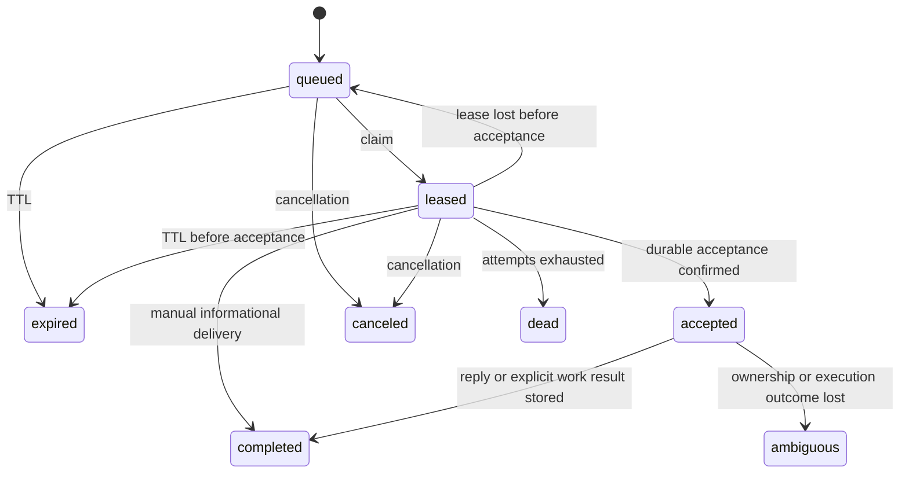

# Agent Messaging lifecycle audit — 2026-10-08

The first-pass record follows; the [second pass](#second-pass--2026-10-08-cxx-0926)
covers commit `63002ff7` and wrapper 0.9.26. The
[third pass](#third-pass--2026-10-08-cxx-0927) covers commit `9788c394`, six further
product defects, one native-canary race and wrapper 0.9.27. The
[fourth pass](#fourth-pass--2026-10-08-cxx-0929) audits baseline `f0a7aee1`
and delivers wrapper 0.9.29 plus further server and CLI repairs.

This audit covers the server, HTTP and local MCP interfaces, interactive native
receivers, detached workers, agent usability, and delivery recovery for Codex,
Claude and Grok. Changes are local on top of `708e2a0a`; wrapper version is
0.9.25. No production deployment, live fleet messaging, provider login/refresh,
or restart of existing native sessions was performed.

## Architecture and ownership

| Layer | Responsibility and reviewed entry points |
| --- | --- |
| Session identity | `agent-session-work.ts`, `agent-messaging/session.ts`, `bindings.ts`: stable addresses, native-session continuity, scoped bridge bearer, current binding generation and one native writer. |
| API and eligibility | `routes/agent-messaging/`, `routes/agent-receiver.ts`, `agent-messaging/eligibility.ts`: host/engine/fleet policy, bridge and relay credentials, participant and chair authorization, request validation. |
| Durable bus | `agent-messaging.ts`, `task-execution.ts`: encrypted payloads, FIFO delivery, claim/lease fencing, confirmed acceptance, immutable result receipts and explicit recovery. |
| Receive health | `agent-receiver.ts`, `receiver-state.ts`, `agent-presence.ts`: native connection generation, source membership, heartbeat freshness and derived presence. A normal wrapper heartbeat cannot manufacture receive readiness. |
| Native runtime | `wrappers/cxx/internal/agentbus/receiver.go`, `native_queue.go`, `grok_queue.go`, `agentportal/`: protected Unix broker, exact native identity, queue admission and correlated peer/Portal replies. |
| Detached execution | `agentbus/worker.go`, `task_result.go`, provider adapters: supervised native resume, process ownership, bounded output, lease renewal, native stop/error parsing and result persistence. |
| Coordination | `call.ts`, `conference.ts`, `groups.ts`, `stall.go`: PINs, chaired rounds, budgets/deadlines, opt-in audiences and bounded call-silence notices. |
| Operator and agent UX | Local 26-tool MCP catalog, managed instructions, metadata-only admin views, explicit audited content reveal, native doctor and the in-app manual. |

Managed native `codex`, `claude` and `grok` entries and wrapper personas
`cdx`, `clx`, `cgx` converge on the same connection lifecycle. Provider binaries
retain their native grammar and execution/approval ownership.

## Native methods

| Engine | Interactive reception | Detached work |
| --- | --- | --- |
| Codex | App Server WebSocket over a private Unix socket; experimental initialization; exact loaded thread identity; `thread/queue/add`. Admission requires both native submission ID and matching `clientUserMessageId`. The native TUI schedules execution. | Wrapper-supervised `exec resume --json` for a saved thread, or `exec --json` for an authorized new identity. |
| Claude | Native MCP Channel notifications from the per-launch plugin; SessionStart identity; matched silent MCP ping proves both pipes before readiness and on heartbeats. | Wrapper-supervised native resume/print mode with JSON results. |
| Grok | Invocation-owned leader, passive framed ACP connection, SessionStart UUID, native roster/activity checks and `session/prompt` with stable prompt metadata. Correlated queue/update events establish admission. | Wrapper-supervised `--no-leader --output-format json`, with exact `--resume` identity when present. |

No receiver synthesizes keystrokes, runs a second native scheduler, or answers
native approval requests. MCP installation, native queue admission, transport
health and an actual model reply are separate pieces of evidence.

The Codex 0.161.0 experimental JSON schema was regenerated locally; its
`QueuedSubmission` requires `id`, `clientUserMessageId` and `input`, matching
the adapter checks. Public reference contracts were also inspected:
[Codex App Server](https://learn.chatgpt.com/docs/app-server),
[Claude Channels](https://code.claude.com/docs/en/channels-reference), and
[Grok headless/ACP](https://docs.x.ai/build/cli/headless-scripting).
The experimental Codex queue methods still require installed-binary schema
verification rather than relying solely on the public App Server page.

## Complete delivery lifecycle

1. A host-authenticated lifecycle registers an eligible engine and address;
   bridge credentials remain behind the wrapper's private broker. Resume binds
   the original native session with a generation fence. Concurrent native
   writers cannot share a binding.
2. Discovery returns eligible identities and derived presence, without message
   bodies. Direct sends use sender-scoped retry IDs; publications snapshot only
   opted-in eligible recipients. A queue receipt confirms persistence.
3. The current receiver or detached worker claims one target delivery. Claims
   have 60-second leases, renewed every 20 seconds; target FIFO and binding
   generations fence competitors. Queue TTL defaults to 24 hours with a
   60-second to seven-day range and a maximum of 12 delivery attempts.
4. Automatic native delivery and v2 work require confirmed durable acceptance
   before exposing content or starting execution. A lost acceptance response
   is retried using the same claim. An expired, unaccepted message cannot start.
5. Native queue admission is correlated to that message. Peer and Portal
   sources share a receiver but keep their own authorization and availability.
   A held delivery prevents another from being silently injected over it.
6. A substantive peer reply uses `agent_reply`; a Portal instruction uses
   `agent_receiver_reply`. Informational peer messages may finish through one
   `agent_listen` without an acknowledgement loop. V2 work must report
   `succeeded`, `failed`, `blocked` or `unknown` with a summary and optional
   evidence; transport completion alone is not success.
7. Result persistence retains the accepted lease after the native child exits.
   A lost storage response retries the same body and claim. It never reruns
   native work to recover a missing result acknowledgement.
8. An expired pre-acceptance lease can retry within its TTL/attempt budget.
   Losing an accepted lease becomes `ambiguous`, with no automatic replay.
   Cancellation revokes delivery authority; it does not undo completed effects
   or guarantee immediate interruption of interactive native work.
9. Finish, host removal, engine suspension, address disable and fleet shutdown
   fence the appropriate bindings and deliveries. Peer-bus shutdown preserves
   a separately enabled Portal connection. Re-enabling peer messaging requires
   a fresh lifecycle binding.
10. Recovery preserves transcript continuity. Ordinary missing transcripts
    require a one-use operator grant for a fresh start; schedules never use a
    fresh-session fallback. Persistent schedule recovery requires explicit
    opt-in and a progress timeout, with bounded retries/backoff when configured.

`completed` is a delivery state. The separately stored work result determines
the reported task outcome. `succeeded` remains an agent report, with evidence
references for review rather than an independent guarantee of correctness.

## Defects repaired

| Finding | Correction and regression evidence |
| --- | --- |
| Grok `sessionId` fallback ran before decoding JSON, so native camelCase identity was discarded. | Apply fallback after decoding; test snake_case, camelCase and precedence. |
| Claude advertised readiness before its first matched ping; startup assigned an artificial pong timestamp. | Require a real current ping before registration; regression proves no model turn is used. |
| Disabling peer messaging detached its address and then broke Portal heartbeat/reconnect through a shared binding check. | Prune disabled source membership and check peer binding only for a peer source; reproduce and verify for all three engines. |
| Server publications disappeared from mailbox rings because Server has no host row. | Left join host metadata; test Server identity with null FQDN and no leaked message body. |
| A full page of recently expired messages hid current waiting messages. | Order current queued messages first; reproduce with 20 missed calls followed by a new message. |
| Work could be accepted after its queue TTL if maintenance had not run. | Check expiry inside acceptance; already accepted work keeps its separate completion lifecycle. |
| `agent_request` hid a successful send when the subsequent wait failed. | Return `sent`, `result`, `wait_error` and recovery guidance; resume waiting on the original conversation. |
| Local send/request tools replaced caller retry IDs; call setup could not recover after consuming its PIN. | Preserve optional UUIDs and expose generated IDs on uncertain errors; replay the original call hello before PIN lookup, with changed-content conflict checks. |
| A worker stopped renewing when the native child exited even while storing/retrying its result. | Renew through completion storage, retry the same result after a lost response, and stop on definitive storage authentication/claim errors. Tests cover slow storage and a completed row rejecting renewal before the lost response is recovered. |
| Wrong-source reply errors gave no route to recovery. A native Codex trace used the Portal tool for a peer message and stopped. | Identify the correct reply tool only for a locally owned delivery; keep the source boundary and make no network request on the misrouted call. |
| Tool/manual text told automatic receivers to poll, described all deliveries as unaccepted and promised cancellation would kill every task. | Align descriptions and operator documentation with automatic reception, v2 results and native cancellation limits; retain explicit peer trust boundaries in work prompts. |
| Two existing CLI surface tests still scanned `run()` after dispatch moved to `runMode()`. | Follow the current shared dispatch function; both baseline failures now pass. |

The call retry ID identifies the original hello even after PIN expiry/reuse;
new calls require new IDs. No schema migration is needed for these repairs.

## Verification collected in this audit

| Check | Result |
| --- | --- |
| API `npm run typecheck`, `npm run lint`, `npm run build` | Passed. Lint retains existing warnings; no errors. |
| API `npm test -- --reporter=dot` | 333 files passed; 4,030 tests passed; 401 DB-dependent cases skipped in this run. |
| Disposable MySQL 8.4 baseline and migration runner | 249 baseline statements and 44 migrations applied to the isolated test database. |
| API `npm run test:db` | All 90 integration files and 1,086 tests passed, including the database-dependent cases. Counts overlap the ordinary API run and are not additive. |
| Go `go test ./...`, `go vet ./...`, `go build ./...` | Passed after the final wrapper changes. |
| Go race tests | Passed for `agentbus`, `agentportal`, `codex`, `claude`, `grok`. |
| Frontend `npm run check` | Svelte: zero errors/warnings; all 915 frontend tests passed. Manual content is served directly from the committed article. |
| Release packaging | 0.9.25 cross-built for Linux/macOS on amd64/arm64; manifest and publishing fixtures passed. No artifact was published. |

The integration coverage includes every one of the nine source/target engine
pairs, participant/chair authorization, receiver generations and policy changes,
calls/PIN expiry, conferences/draining/deadlines/budgets, opt-in publications,
encrypted work outcomes and idempotency, one-use fresh-start grants, schedule
recovery, portal operations and queue starvation/pool behavior.

Native canaries use temporary homes, brokers and conversations with access-only
credentials. Both peer and Portal challenges require exact correlated MCP
replies, then repeat after a forced receiver generation change in the same
native conversation; stopping the broker must report `unavailable`.

| Native CLI | Final artifact result |
| --- | --- |
| Codex 0.161.0 | Passed: both sources, correlated replies before/after reconnect, offline broker unavailable. |
| Claude Code 2.1.293 | Passed: both sources, correlated replies before/after reconnect, offline broker unavailable. |
| Grok 1.0.46 | Passed: both sources, correlated replies before/after reconnect, offline broker unavailable. |

Grok's final canary completed in 42.28 seconds with 14 ms ACP admission; its
external-access credential generation transitions 17 → 18 → 19 also passed
without a provider refresh grant. The final Codex run passed after adding the
source-specific reply guidance. This does not imply deterministic model behavior.

The final development wrapper tested by these canaries has SHA-256
`30c49dbb9fac0265f7c8332845b384e6576a97b59bc5edce9bab5fa00750310e`.
The separately built Linux amd64 0.9.25 release artifact is
`b8e9b226c0c7135d804d99ae4d83f1e35f9e27b8319aac64130f2a47bd48e9bf`;
release metadata differs from the development canary artifact.

Earlier failures are retained as evidence: targeted regressions failed before
their fixes; the first Grok fixture omitted native identity metadata from its
access-only projection and was rejected with `Authentication required` before
any model turn. Preserving that metadata while omitting refresh credentials
resolved the fixture. Codex had reply timeouts; a captured native transcript
showed the wrong reply-tool selection described above. Model behavior remains
nondeterministic; queue acceptance by itself must never be reported as a reply.

Local command logs are `/tmp/messaging-audit-*-20261008.log`; temporary build and
schema artifacts are under `/tmp/cxx-messaging-audit-20261008/`. These are local
diagnostics, not durable production evidence or a source of credentials.

## Delivery and remaining boundaries

The implementation continues to use native methods for all three engines.
Real model canaries and database tests establish separate adapter and server
proofs; they do not establish an arbitrary task's correctness or a deployed
fleet-wide end-to-end matrix. Linux native execution was tested; macOS and arm64
artifacts were cross-compiled without native runtime testing on those platforms.
Existing esbuild target/deprecation and lint warnings were not expanded into
unrelated dependency changes.

Rollout requires the API changes followed by wrapper 0.9.25; existing receiver
processes need a new launch to load the fixes and tool guidance. No database
change is required. A rollback can restore the previous API and wrapper
artifacts without a data migration. Verification ran on the uncommitted worktree;
source delivery is recorded in Git. Production was not published or restarted.

## Second pass — 2026-10-08, cxx 0.9.26

Baseline: clean `main` at `63002ff7b6bb083f5fbd6babc57b731827774ce9`, the
first-pass fix commit, already one commit ahead of the local `origin/main` ref.
This pass changes the API, shared native receiver, regression tests and matching
documentation. No production rollout, branch change, push, provider login
or credential refresh was performed. Fleet project discovery found no active
`codex-orchestrator` project; the repository remains the audit handoff.

### Findings repaired

| Finding and consequence | Repair and evidence |
| --- | --- |
| An interactive result could commit while its response was lost. The next renewal returned `agent_messaging_lease_lost`, and the tracker discarded the original claim and report. | Retain pending result/reply bodies after terminal renewal; retry their original storage operation. `TestInteractiveLostResultSurvivesTerminalRenewal` failed on the baseline and passes now. Renewal stops without claiming that receipt storage failed or succeeded. |
| A second tool invocation could overwrite an uncertain reply/result with changed content. The server's immutable-result rule then conflicted with every subsequent retry. Portal event retries had the same problem. | Keep the original peer result/reply and Portal content/summary until confirmation. Reject changed retry arguments locally; explicit validation rejection permits correction. Peer and Portal lost-response tests cover payload retention; the peer validation regression verifies corrected input. |
| Concurrent `agent_reply`, `agent_task_result` and `agent_listen` calls could complete the same delivery out of order. A default `unknown` completion could win ahead of the intended report. | Serialize completion operations per delivery, with lease renewal independent of the network-bound completion lock. The concurrency test holds the first reply in flight and proves listen cannot complete ahead of it. |
| A transport reconnect abandoned peer work as ambiguous and cleared an outstanding Portal instruction even though its native conversation was still running. The model then could not reply to work it already held. | Preserve ownership across reconnects to the same native identity and use the MCP process lifetime for renewal. Never resubmit the content. The baseline reconnect regression fails for both held sources; final MySQL tests prove accepted renewal and completion across all nine engine pairs. |
| Binding, authentication and authorization failures outside a short error-code list left a revoked delivery held indefinitely. | Treat HTTP 401/403/404/409/410 as definitive renewal rejection; keep 429 and transient server/transport failures retryable. Retain uncertain storage receipts separately. Tests cover both classes. |
| An operator could approve a missing-transcript replacement after the original queue TTL elapsed, but the replacement kept that expired deadline and old delivery budget. | Give the explicitly approved new execution a default 24-hour queue window, zero attempts and cleared terminal timestamps. Existing approval idempotency and one-use consumption remain unchanged. The baseline DB regression could not claim its replacement; the repaired test claims and consumes it once. |
| Replaying an already stored work reply changed `completed_at`, making the recorded finish time depend on network retries. | Validate the immutable result but skip the terminal-row rewrite. The database regression checks the retained original timestamp for Codex, Claude and Grok. |
| Portal acceptance required a second heartbeat before submitting to native. A failure between those two writes stranded an accepted instruction without delivering it. The adapter also did not inspect the acceptance status. | Record a supplied upstream turn ID atomically with acceptance. Retry a lost ACK using the same message/lease; require the Portal API's top-level `status: accepted`; remove the second heartbeat dependency. API transaction coverage and wrapper failure-injection tests prove the boundary. Native canary stubs now use the actual Portal response shape rather than the peer ACK envelope. |
| The manual claimed that work could not be released without an explicit result, while implementation intentionally stores `unknown` in that case. | Align API/operator documentation with the executable contract. Agents should report explicit outcomes; transport completion alone is not success. |

Two related invariants are pinned by new tests: explicitly closing Portal releases
its local gate so peer reception continues; Claude `/clear` is a native identity
change, not a transport reconnect. Old held work is retired without replay before
the new Claude conversation is registered. Codex and Grok retain their exact
bound-root checks. These guards preserve the existing native lifecycle behavior
while changing reconnect recovery.

The wrapper failure-injection suite is
`wrappers/cxx/internal/agentbus/recovery_test.go` (ten tests). The initial baseline
run failed on lost receipt correlation, changed retry payload and reconnect
ownership. The initial MySQL run failed the three completion timestamp cases
and the expired fresh-start case. Later concurrency, Portal and revocation tests
pin the repaired boundaries; they are not represented as independently captured
baseline failures.

### Lifecycle coverage and native methods

| Phase | Reviewed path and verification |
| --- | --- |
| Registration and identity | `session.ts`, `bindings.ts`, `agent-receiver.ts`; bridge/host/engine gates, stable address, binding generation, single current native writer, silent receiver health and receiver replacement. |
| Discovery and admission | `sendMessage`, local MCP tool catalog, call/PIN and publication paths; scoped discovery, sender retry IDs, encrypted payloads, eligible opt-in recipients, TTL and retained send receipts. |
| Queuing and claiming | `claimDelivery`, receiver and relay HTTP routes; FIFO, one in-flight item per target, claim replay, source and generation checks, compatibility gates and real-database starvation tests. |
| Native delivery | Codex protected App Server WebSocket and `thread/queue/add`; Claude plugin MCP Channel notifications and matched pings; Grok protected leader with framed ACP and correlated `session/prompt` admission. Native methods and permission ownership remain in place. |
| Running and replying | Process-owned lease renewal; native submission distinct from reply; serialized peer completion and Portal reply operations; confirmed durable acceptance before content exposure; explicit task results remain separate from transport state. |
| Retry and reconnect | Exact payload/claim retention, transient versus definitive errors, process lifetime versus connection generation, same-session reconnect without replay, and actual native conversation replacement. |
| Calls, conferences and groups | Existing MySQL suites cover PIN consumption, readiness, chair/participant authorization, dispatch completion, budgets/deadlines/draining, scoped subscriptions and private-message isolation. This pass requires no protocol or schema redesign. |
| Cancellation and finish | Existing cancellation/binding/relay tests remain green; accepted lease loss stays ambiguous and ordinary work is not replayed automatically. Cancellation cannot undo completed effects or guarantee interruption of interactive native tools. |
| Recovery and operators | One-use ordinary missing-transcript grants, schedule restrictions and persistent recovery limits; metadata-only admin reads and audited reveal; corrected operator manual and all three engine interface documents. |

The public contracts were rechecked against
[OpenAI's App Server documentation](https://learn.chatgpt.com/docs/app-server),
[Claude's Channels reference](https://code.claude.com/docs/en/channels-reference)
and [Grok's headless/ACP reference](https://docs.x.ai/build/cli/headless-scripting).
The installed Codex 0.161.0 generated schema from the first pass remains the
specific queue-contract evidence. This pass did not change the native transport
methods. Public App Server transport documentation marks the interface experimental;
the native canaries below verify the installed versions, not future compatibility.

### Verification

| Check | Result |
| --- | --- |
| API typecheck, lint, build | Passed; lint has 108 existing warnings and zero errors. |
| API full suite with coverage | 333 files and 4,030 tests passed; 401 DB-dependent cases skipped here and exercised separately. Coverage: statements/lines 66.04%, branches 81.92%, functions 74.20%; all repository thresholds met. |
| Disposable MySQL 8.4 | Repository baseline and all 44 migrations applied; messaging suite: 138 passed. Final full integration rerun after all source changes: 90 files / 1,086 tests passed in 178.06 seconds. |
| Final targeted DB regressions | 28 messaging durability tests passed, including accepted reconnect for all nine engine pairs; 61 Portal integration tests passed after atomic acceptance. |
| API contract checks | 32 files / 133 tests passed after interface and wrapper updates. |
| Go canonical `make test` | All packages and manifest/publishing fixtures passed. |
| Go build, vet, race | Passed; race covers agentbus, agentportal, Codex, Claude and Grok after the final source changes. |
| Frontend `npm run check` | Svelte zero errors/warnings and all 915 frontend tests passed. The updated manual article is served directly; no generated SPA bundle change is required. |
| Release packaging | 0.9.26 built for Linux/macOS, amd64/arm64, under a temporary output root; nothing published. |

Fresh final native canaries used isolated homes, temporary local brokers and
access-only credential copies. Each engine returned exact correlated peer and
Portal tool replies, repeated after a forced receiver-generation change in the
same conversation, and reported unavailable when its broker stopped.

| Engine and native binary | Final result |
| --- | --- |
| Codex 0.161.0 | Passed, both sources, reconnect and offline-broker checks. |
| Claude Code 2.1.293 | Passed, both sources, reconnect and offline-broker checks. |
| Grok 1.0.46 | Passed in 44.11 seconds; 1 ms ACP admission; both sources, reconnect and offline-broker checks. Access-only generations 17 → 18 → 19 also passed without provider refresh grants. |

All final native canaries used the same development wrapper:
`b04fc173b7dd9d50921a6fb3afed16c6574af963f301b1161d937e4c73cba1b5`.
The separately built Linux amd64 0.9.26 artifact is
`e83fee2b838caaa80060cd0bade6479e62be3ef042f146f389a235acbec81003`.
Build metadata accounts for the different hashes.

Logs are `/tmp/messaging-r2-*.log`; artifacts are under
`/tmp/cxx-messaging-r2-20261008/`, with the final packaged binaries in
`release-final/`. These are local diagnostics, not production deployment records.
The disposable MySQL container and its test-data volume were removed after the
final passing run; they can be recreated from the repository baseline and migrations.

### Delivery limits and rollout

The source changes target wrapper 0.9.26 on the original branch. Deploy the API first,
then wrapper 0.9.26 and launch fresh managed sessions to load it. Existing native
processes were not restarted. There is no new migration; rollback restores the
prior API and wrapper artifacts.

Database failure injection, native adapter canaries and arbitrary task completion
are separate claims. The live canaries use stub brokers, not production fleet
messages; in-flight reconnect and receipt-loss races are reproduced by controlled
wrapper tests and real-DB session tests. macOS/arm64 were cross-compiled, not
executed natively. MCP-process loss still loses local reply correlation; accepted
peer work then expires to ambiguous and requires explicit recovery. Same-process
transport reconnect preservation does not promise survival of a killed native
conversation or exactly-once external task effects.

## Third pass — 2026-10-08 (cxx 0.9.27)

Reviewed and fixed locally on `main` above `9788c394cc9021a1fd5fe0840951c123d66ef737`.
The starting worktree was clean. The prior two audit records remain historical
evidence; their passing tests were not treated as proof of this pass. No branch
change, commit, push, deployment, production migration or existing native-session
restart was performed.

### Findings and repairs

| Defect | Repair and reproduced boundary |
| --- | --- |
| A session could reply to queued work without a delivery claim. The reply advanced conference completion while the original task remained runnable. | `replyMessage` requires a claim for every v2 work reply. The existing accepted-claim/result fence then applies. All three engine regressions failed before the fix: no-claim and leased-but-unaccepted replies are rejected, and an accepted reply without an explicit report records `unknown`. Five conference tests now claim and accept their tasks before replying, rather than exercising the invalid bypass. |
| Portal accepted a claim after its 30-second lease expired if maintenance had not yet reaped it. | Acceptance checks the live owned lease under the same row lock as its event and active-turn update. The real-DB regression failed before the fix and proves a rejected stale attempt creates neither an acceptance event nor an active turn. |
| After a new Portal claimant accepted, a superseded claimant received the same successful acceptance response. That response could authorize stale native submission. | Retain `lease_owner` as immutable acceptance-receipt correlation and clear only `lease_until`. Replays require the accepted owner, outcome and normalized upstream ID. The regression failed on the previous code after reclaim and acceptance; it now rejects the old claim and changed upstream ID while permitting the identical retry. No schema change is needed. |
| Rejoining a conference reset a dispatched member to `seated`, allowing another task while its previous task remained held. | Preserve `dispatched`, the dispatch pointer and deadline on rejoin. The real-DB baseline regression observed the seat become available; the repaired test keeps it busy and rejects overlapping dispatch. |
| `agent_conf_join` and `agent_conf_say` completed every local held delivery. A progress update could finish a task as `unknown`, or complete another room's informational message. | Track immutable delivery kind and room correlation. Conference controls complete only that room's informational delivery; v2 and legacy work stay held. Both join/say failure-injection cases failed before the fix. Existing invitation-release tests and the new other-room test verify that legitimate informational completion still works. |
| `agent_listen` reported `automatic` for a healthy receiver with only Portal enabled, or no peer source. The model could yield waiting for an impossible peer delivery. | Carry registered/heartbeat source membership into local health. Peer listen returns `receiver_unavailable` with `peer_source_unavailable`; source-disabled recovery returns immediately, while startup still has its bounded readiness wait. Tests cover no sources, Portal only, peer only and both. Portal reception remains independent. |
| The real Grok canary intermittently cleared SessionStart identity on a native-identity read. Production uses POST for both reads and reports; the stub replaced identity with an empty read body. | The stub updates identity only for a nonempty reported native-session ID. The final real Grok run establishes SessionStart, ACP admission, correlated peer/Portal replies, reconnect, offline health and access-only credential renewal. This was a test-harness race, separate from the six product defects. |

The completion fixes live in `agent-messaging.ts`, `agent-portal.ts`,
`agent-messaging/conference.ts`, and the shared Go `agentbus` adapter. There is
no provider-specific shortcut around the repaired fences. Managed fleet guidance,
the built-in conference Skill source, API/DB and all three engine interfaces,
the overview, changelog and directly served operator manual describe the new
behavior. Managed-document digests were deliberately updated for the changed
fleet instructions; the tool-name scanner now recognizes `task_result` as an
argument rather than inventing a missing tool.

### Full lifecycle review

| Surface or phase | Reviewed contract and evidence |
| --- | --- |
| Engine/host eligibility and identity | Host and fleet switches, session bridge authentication, stable address and native binding generations, exact transcript roots and single native writer. Current service code and real-DB authorization/binding tests were inspected; peer input does not grant operator authority. |
| Send, request and retry | Encrypted bodies, sender-scoped client UUIDs, immutable retry payloads, TTLs, conversation participation and saved request receipts when only reply waiting fails. Acceptance, reply and result are distinct transitions. |
| HTTP and local MCP API | Strict route schemas, scoped host/bridge/relay authentication, all 26 local tools, room/chair authorization and explicit error recovery. HTTP callers supply accepted claims; native MCP retains and injects its owned claim for replies/results. |
| Queue and admission | FIFO, one held item per address, live lease ownership, bounded attempts, binding and relay generation fences, protocol compatibility and dormant-address filtering before the relay candidate limit. Native content is exposed only after confirmed durable acceptance. |
| Automatic and manual reception | Source membership, matched silent transport health, registration/heartbeat/stop lifecycle, manual accepted-work exposure and held-delivery gates. Healthy Portal cannot manufacture peer readiness. |
| Interactive execution and receipts | Native admission versus model response; process-owned renewal; exact message/claim correlation; immutable uncertain payloads; serialized result/reply/listen completion. Same-native reconnect retains ownership without resubmitting work. |
| Detached execution | Registered per-user worker, eligibility/capacity checks, native transcript resume, wrapper supervision, process ownership, bounded result parsing and renewed lease while result storage is pending. Missing ordinary transcripts require explicit one-use operator approval; schedules never use a fresh replacement. |
| Calls | Listener readiness before opening/joining, single-use PINs, original client UUID replay after PIN consumption, atomic HELLO/conversation creation and bounded local silence notices. Ordinary informational replies do not create more work. |
| Conferences | Multi-use room PINs, invites and native/headless membership, seated versus dispatched state, chair-only dispatch, progress versus report, per-spoke budgets, deadlines and graceful versus forced adjournment. The new regression fences cover both API state and local held-delivery release. |
| Groups and publications | Opt-in subscriptions, audience snapshots, explicit group membership, sender/topic/body/TTL retry digest, fan-out limits and per-recipient receipts. Private direct, call and conference traffic is not republished; Server publications are informational. |
| Wake/Cron and recovery | Read/version/update contract; missed interval ticks coalesce; accepted work survives schedule pause/delete; persistent recovery requires explicit configuration, bounded delay and optional maximum. Missing transcripts block schedule recovery. Recovery after an ambiguous crash can repeat effects. |
| Cancellation, shutdown and maintenance | Claim revocation, finish/binding cleanup, accepted ambiguity instead of automatic replay, per-source closure, expired queued work and retained outcome receipts. Cancellation cannot undo native effects or promise interruption of an attached interactive tool. |
| Agent and operator usability | Correct peer versus Portal tool, explicit result statuses and evidence, once-only informational release, no acknowledgment loops, room-specific progress handling, source-specific unavailable reason, metadata-only operator views and audited content reveal. |

### Native methods and engine parity

| Engine | Interactive method | Detached method and final native evidence |
| --- | --- | --- |
| Codex / `cdx` | Protected App Server WebSocket, bound loaded thread, `thread/queue/add` with submission and client-message correlation. The native scheduler owns execution and approvals. | Native `exec resume --json` for the stored transcript. Codex 0.161.0 passed exact peer and Portal replies, both again after a forced generation reconnect, and offline-broker detection. |
| Claude / `clx` | Native MCP Channel notifications, SessionStart identity and matched silent pings proving both MCP pipes. `/clear` changes identity and revokes old local ownership. | Native resume/print mode with JSON result parsing. Claude Code 2.1.293 passed the same two-source, reconnect and offline checks. |
| Grok / `cgx` | Invocation-owned protected leader, framed ACP, native SessionStart UUID/roster and correlated `session/prompt` admission. No secondary native scheduler is added. | Native `--no-leader --output-format json` with exact `--resume` when present. Grok 1.0.46 passed in 42.29 seconds, with 16 ms admission and access-only generations 17 → 18 → 19; no provider refresh grants or helper-cache writes. |

All three personas and managed native command names use the same repaired
receiver/tracker. Engine parity is tested at the API boundary separately from
actual installed-native behavior. The native transport contracts cited in the
first and second passes remain unchanged; passing these installed versions does
not guarantee compatibility with a future experimental native protocol.

### Verification and reproducibility

Final checks use repository commands, with DB suites run serially against the
disposable MySQL 8.4 instance on `127.0.0.1:33318`. The repository baseline and
all 44 migrations were applied through its normal setup/runner; production DB
and `.env` were not used or changed.

| Check | Final result |
| --- | --- |
| API `npm run typecheck`, `lint`, `build` | Passed; lint reports 108 existing warnings and zero errors. |
| API `npm test -- --coverage --reporter=dot` | 333 files / 4,030 tests passed; 406 DB-dependent cases skipped here and covered by the separate DB run. Coverage: statements/lines 66.03%, branches 81.92%, functions 74.20%; repository thresholds met. |
| API full serial `npm run test:db` | 90 files / 1,091 tests passed in 203.90 seconds against real MySQL, including all engine directions, Portal acceptance and schedule/conference lifecycle. |
| Targeted DB before broad verification | 15 files / 204 messaging, Portal, binding and receiver tests passed. New baseline failures are retained separately; the final full DB run includes the additional superseded-claim regression. |
| Go canonical `make test` | Passed all packages plus manifest merge and publication fixtures. |
| Go build, vet, race | Passed after the final wrapper source changes. Race covers agentbus, agentportal, Codex, Claude and Grok. |
| Go traced configuration | `make test-traced` passed its tagged vet and full tagged suite. |
| Frontend `npm run check` | Svelte zero errors/warnings; all 915 frontend tests passed. The manual is directly served; no SPA bundle change is needed. |
| Wrapper packaging | 0.9.27 built locally for Linux/macOS, amd64/arm64; version manifests and checksums produced. Nothing published. |
| Actual native model canaries | Codex, Claude and Grok all passed using the final wrapper source, isolated homes, local brokers and access-only credential projections. |

The native canary development wrapper SHA-256 is
`39472f0d7a5255edb15afdbaa5f5269cc2544b66ed86a2343f6598f6e48e2fad`.
The packaged Linux amd64 0.9.27 SHA-256 is
`d3d629011aa6f6fcc249336ebc21a8ab64b04f9ea14676ed9ae05a1073787aa3`.
Release metadata and trimming account for the different hashes.

Evidence logs are `/tmp/messaging-r3-*.log`. The final API/DB logs end in
`api-all-delivery-final.log` and `db-all-delivery-final.log`; final wrapper
logs include `go-all-artifact-final`, `go-race-artifact-final`, `go-traced-final`
and `release`. Native logs are `native-codex-final`, `native-claude-final` and
`native-grok-artifact-final`. Artifacts are under
`/tmp/cxx-messaging-r3-20261008/release/`. These temporary diagnostics are not
deployment evidence. The disposable MySQL container and its anonymous test-data
volume were removed after verification; the task-owned Grok access-only
credential projection was removed too. Native-canary temporary homes were
cleaned by their harnesses. Test data can be recreated with the repository
baseline and migration runner.

Earlier unsuccessful diagnostic commands were corrected, not counted as green
checks: an initial full DB command omitted the temporary DB environment and
hit connection refused; a multi-file Portal run omitted serial execution and
its shared feature flags raced; the first full API run exposed the missing
`task_result` scanner whitelist. Grok fixture setup also needed the documented
access-only auth shape before the identity-read race could be reproduced.

### Agent usage, rollout and remaining limits

For work, keep the accepted delivery until `agent_task_result` or `agent_reply`
stores the outcome. Use `agent_conf_say` for progress while still working;
joining/rejoining or progress does not release that task. `agent_listen` means
the held delivery is finished and can store `unknown` if no report was supplied.
For informational conference messages, join/say releases only the matching room;
other informational replies can still be released with one listen. Yield for
peers only when listen says `automatic`, and report source/transport unavailability
instead of waiting indefinitely. Retry uncertain receipts with identical input.

Deploy the API before publishing wrapper 0.9.27, then start fresh managed native
sessions to load the repaired tracker. No migration is required. Already
accepted legacy Portal rows have no retained receipt owner; their acceptance
cannot be replay-authenticated after upgrade, so inspect their durable state
rather than executing them again. Rollback restores prior API/wrapper artifacts;
there is no task-owned production data to restore.

The real-native canaries used local stub brokers and did not send messages to
the production fleet. They prove installed-native admission and correlated model
replies; real-DB/failure-injection tests prove the server and race boundaries.
macOS/arm64 were cross-built, not executed natively. Lost MCP/native processes
can still lose local reply correlation, and accepted work then becomes ambiguous;
exactly-once external effects are not guaranteed. Conference fan-out is still
per-recipient rather than transactional and must not be blindly retried after
uncertain partial delivery. Retained history has no automatic bus-wide purge.

## Fourth pass — 2026-10-08, cxx 0.9.29

Baseline was clean `main` at `f0a7aee1e03f28c728f61b15b8940a47c588490a`,
three commits ahead of the local `origin/main` reference. All three preceding
repair commits and their audit records were present. Fleet discovery again
found no matching active project; the Git Director showed no competing worker
in this clone. This pass makes local source changes only: no branch changes,
commit, push, deployment, production migration or existing-session restart.

### Repaired failure boundaries

| Finding | Repair and evidence |
| --- | --- |
| Informational replies ignored supplied claims; an expired or superseded claimant could queue a reply even though work replies were fenced. Omitting the claim also bypassed a held informational delivery. | Claimed replies check owner, binding, live lease and pre-acceptance TTL. In-flight or ambiguous informational deliveries require their claim. Real-MySQL regressions reproduce stale acceptance for Codex, Claude and Grok, then verify rejection and the valid successor. Completed informational messages retain the ordinary participant reply path used by one-shot CLI readers. |
| Informational reply storage and parent completion were separate operations, so a crash after storing the reply could leave the parent accepted and later ambiguous. | Commit the reply and parent completion in one transaction, retaining terminal receipt ownership. Tests inspect the completed parent before any follow-up ACK and replay the identical reply. Relay native identity persistence now also occurs in that transaction for informational replies. |
| Relay receipt retries silently returned an existing reply even when the retried content changed. | Validate the stored content, target, conversation, parent and kind before returning the receipt; changed content produces `agent_messaging_client_message_id_conflict`. |
| Disabling a recipient hid a previously committed send or reply receipt behind current eligibility checks. A lost response could no longer be resolved. | Authenticate and validate the original receipt before enforcing eligibility for a new delivery. Identical receipts return their current stored status; new sends and changed content remain rejected. Real-DB tests cover both session and relay replies and an original send canceled by recipient disablement. |
| Renewal discovered TTL expiry and wrote `expired`, then threw inside the transaction, rolling the cleanup back. | Commit expiry and lease clearing first, then return `agent_messaging_message_expired`. The baseline regression observed the old `leased` row after the error; the repaired test observes `expired` and no lease. |
| Reusing a receiver generation with a different native session ID reported success for the old identity. Registration retries could also advertise a newly enabled source absent from the stored connection. | Reject changed native identity with `receiver_registration_conflict`; return the stored generation's sources. Tests cover all three native protocols, identical retries and a Portal switch change between retries. |
| The one-shot CLI had missed the earlier MCP retry repair: request waiting failures discarded committed send receipts, and send/request/reply/call-join could not reuse their generated UUID. | Return `sent`, `wait_error` and recovery guidance after a committed request; add `--client-message-id` and include the generated UUID in uncertain-send errors. Private Unix-broker tests exercise the actual CLI functions and all four retry paths. |
| One-shot `cxx agent listen` claimed v2 work, then tried to complete it without acceptance or an enduring lease owner. It failed and left the task leased. | Add optional `informational_only` to the session claim API. CLI readers use it; v2 and legacy work remain queued without attempts or capability errors, preserving FIFO. Persistent native MCP and background workers keep the execution lifecycle. Real-DB and CLI regressions cover both sides. |

The operator then supplied an obsolete Feuerwehr delivery addressed to a
`continuity:reset` identity at binding generation 91. Source inspection reproduced
the cause: fresh wrapper lifecycles inherited the latest dormant mailbox solely
by matching host/user/engine/cwd. Nine new real-DB baseline cases failed across
all engines. Fresh launches now mint independent addresses; native receiver
registration and explicit heartbeat binding recover an old address only by exact
transcript identity. Picker/continue resumes recover their selected transcript's
mailbox once known. Native conversation changes (including Claude `/clear`)
switch addresses, preserving old queues, aliases and subscriptions on the old
identity. Concurrent native bindings are rejected. Informational relay deliveries
without native continuity become terminal `native_transcript_missing` before
any native launch, including with older workers. No old production messages or
sessions were modified, and the supplied peer instructions were not acted on.

The native Grok canary also exposed a harness assumption: ACP sometimes names a
receipt tool `agent_reply` instead of `cxx-agent__agent_reply`. Its isolated
approval list now accepts exactly the two peer/Portal receipt tools in short
and qualified form. A unit test rejects unrelated or lookalike names. Production
native approval handling is unchanged; the receiver never answers tool approvals.
CLI help now includes Grok and documents the one-shot/retry behavior.

### Full lifecycle and surface review

| Phase | Fourth-pass review and verification boundary |
| --- | --- |
| Launch and identity | Persona and managed native starts converge on the same wrapper lifecycle. Bridge tokens, host/engine policy, current native identity, address binding and relay generations remain distinct. Receiver registration now verifies identity even on UUID replay. |
| Discovery and eligibility | Metadata-only discovery derives presence from native receiver and wrapper freshness. Fleet switches, host policy, insecure windows and disabled addresses gate new delivery; historical receipt recovery does not authorize a new send. |
| API and local tools | Reviewed strict HTTP schemas, session/relay authorization, participant/chair checks, local MCP tool dispatch, private broker routing and CLI entry points. The added claim flag is optional and defaults to the existing persistent-adapter behavior. |
| Queue and delivery | Durable encrypted rows, sender retry UUIDs, FIFO, one in-flight message, bounded attempts and expiration are covered by the serial MySQL suite. Informational-only reads do not jump past work at the FIFO head. |
| Acceptance and native admission | Confirmed server acceptance precedes native exposure. Codex queue IDs, Claude ping/channel health and Grok ACP admission remain separate from actual model replies. Tests include all nine engine source/target directions. |
| Execution and completion | Work remains accepted and renewed until an explicit report or terminal transport outcome. Informational replies now receive the same transactional receipt protection. Completed delivery and reported task success remain different facts. |
| Retry, cancellation and reconnect | Lost receipts retain the original UUID/body. Receiver generation changes do not replay accepted native work. Stale claims and bindings cannot store new replies. Cancellation cannot reverse external effects or promise immediate interruption of interactive tools. |
| Calls and conferences | PIN ownership/expiry, call turn handling, room invitations, chair-only dispatch, held work during progress, budgets, deadlines and forced/graceful adjournment remain covered. Conference fan-out intentionally returns per-recipient results. |
| Publications | Opt-in group/feed membership, audience snapshots, immutable retries and Server informational delivery are covered. Private direct/call/conference content is not republished. |
| Schedules and recovery | Explicit acceptance/results, coalesced wakes, versioned configuration, opt-in persistent resume and missing-transcript fences remain covered. One-shot CLI consumption now cannot interfere with scheduled work. |
| Teardown and operator views | Session finish, source shutdown, stale-binding cleanup, maintenance, manual redrive and retained history were reviewed. Admin metadata/reveal authorization and central WebSocket invalidation tests pass separately from native delivery tests. |
| Agent usability | Distinguish peer reply from Portal reply, progress from task completion, and automatic reception from polling. Use native MCP for work, CLI listen for informational reads, and identical UUID/content on uncertain CLI retries. The operator manual and all three engine interfaces document this. |

### Native methods and final packaged binary

| Engine | Interactive / detached methods | Fresh native canary |
| --- | --- | --- |
| Codex 0.161.0 | Private App Server WebSocket and `thread/queue/add` for the bound loaded thread; detached native `exec resume --json`. | Passed peer and Portal replies, repeated after forced generation reconnect, then unavailable health after broker shutdown. |
| Claude Code 2.1.293 | Native MCP Channel notifications, SessionStart identity and matched silent pings; detached resume/print JSON. | Passed the same two-source reply, reconnect and offline checks. |
| Grok 1.0.46 | Protected invocation-owned leader, framed ACP and correlated `session/prompt`; detached `--no-leader --output-format json` with exact resume identity. | Passed in 47.02 seconds; 21 ms admission; access-only generations 17 → 18 → 19 without refresh grants or helper-cache writes. |

These final canaries all used the packaged Linux amd64 0.9.28 binary, SHA-256
`ca11b4306862fd71dc4bf0387fcad8daf545466a1d8036814e3172dc4ef239ae`.
They used isolated homes, temporary private brokers and access-only credentials;
no production fleet messages were sent. They prove native admission and exact
correlated model replies against local brokers. Server correctness and cross-engine
routing are established separately by real-MySQL and fault-injection tests.

### Verification

Final API typecheck, lint and build passed (108 existing lint warnings, zero
errors). The coverage run passed 333 files / 4,030 tests, with 431 DB-dependent
cases skipped there and exercised separately; coverage was 65.96% statements
and lines, 81.92% branches and 74.15% functions, meeting repository thresholds.
The serial full real-MySQL run passed all 90 integration files / 1,112 tests in
213.23 seconds. The subsequent full messaging run passed all 11 files / 167 tests in 64.10
seconds, including the final native heartbeat and concurrent-binding regressions
added during that broad run.

Go `make test`, build, vet, race tests for agentbus/agentportal/Codex/Claude/Grok,
and `make test-traced` passed on the final wrapper sources. Frontend checking
reported zero Svelte errors/warnings and all 915 tests passed. Wrapper 0.9.28
cross-built for Linux/macOS on amd64/arm64; manifest and publication fixtures
passed. The operator manual is directly served, so no SPA bundle rebuild was
needed for its text change.

Baseline failures are retained in `/tmp/messaging-r4-*-baseline.log` (including
the serial receipt baseline), and final checks in `/tmp/messaging-r4-*.log`.
The first broad messaging run was contaminated by an accidentally overlapping
DB regression invocation: shared feature flags caused three schedule failures.
Both were discarded as verification evidence; the serial messaging run then
passed 148 tests, followed by the full serial integration run. Two test invocations initially ran from the repository root and exited 254
(`ENOENT: package.json`); both were rerun from `api/`. No test command
ran against production or the repository `.env`. MySQL 8.4 was isolated on
`127.0.0.1:33318`, initialized from the repository's 249-statement baseline and
all 44 migrations. Existing esbuild target/deprecation and lint warnings remain.
The initial Grok canary failed on the tool display-name assumption above; the
repaired harness and final packaged-binary run passed.

### Rollout, rollback and limits

Deploy the API first, then wrapper 0.9.29: an older strict API rejects the new
`informational_only` field. Start new wrapper processes to load the updated CLI;
no database migration is needed. Rollback is the previous API and wrapper pair.
Existing sessions that already inherited an unrelated mailbox are not silently
rebound or purged; start a fresh native conversation after deploying the API to
get the corrected identity lifecycle. There is no task-owned production state
to restore. An unrelated Android `ConversationList.kt` edit appeared during
verification and was preserved. The operator subsequently authorized commit,
push and production deployment on 2026-10-08. Deploy the API before publishing
wrapper 0.9.29; retain the previous image, wrapper manifests and a database backup.
Unrelated Android/Companion work stays outside this delivery. Local artifacts are under
`/tmp/cxx-messaging-r4-release/`.

Linux native behavior was executed; macOS/arm64 were cross-built only. This is
not a deployed fleet-wide end-to-end test. Exactly-once external effects are
not guaranteed after an ambiguous native crash. Process-local correlation can
still be lost when an MCP process dies; retained server state must be inspected
before retrying work. Conference fan-out remains per-recipient and must not be
blindly retried after uncertain partial delivery. Bus history remains retained
without an automatic purge. These are explicit operational boundaries, not
claims that a passing transport test proves an arbitrary task succeeded.

### Authorized production delivery

The operator authorized commit, push and deployment after the audit. Commit
`a1b272be` contains the fourth-pass repairs; `origin/main` also received the
three earlier audit commits. The shared worktree release counter had advanced
to **0.9.29** before staging, so 0.9.29 is the shipped version. The 0.9.28 native
canary hashes above remain the actual pre-commit test artifacts; they are not
claims about the production binary hash. Unrelated Android/Companion source
changes were left unstaged.

Production target: `root@docker01.uggs.io`,
`/var/docker_data/codex-auth.uggs.io/app`. The API and quota worker were rebuilt
and restarted before wrapper publication, with 44 applied migrations and none
pending or drifted. Rollback material is under `backups/messaging-r4-20261008/`,
API image tag `codex-orchestrator-api:rollback-messaging-r4-20261008`, and database
dump `backups/codex-orchestrator-20261008T124858Z.sql`. Deployment logs on the
operator host are `/tmp/messaging-r4-deploy-api.log` and
`/tmp/messaging-r4-deploy-wrappers.log`.

Wrapper publication completed: all four platform manifests serve 0.9.29; the
Linux amd64 binary reports commit `a1b272be`, embedded signing key and SHA-256
`c343ad8eac0279eecc9d11bc903e8a2173f8f06831649a0ac23f14a6b324e93a`.
The running API bundle contains the native-identity, informational-only and
receiver-registration fences. Both deployment phases completed with healthy
services and no critical log matches. An extra Python 3.13 public HTTPS probe
failed on strict CA key-usage validation; the deployment uses curl with normal
certificate verification, not a TLS bypass.
