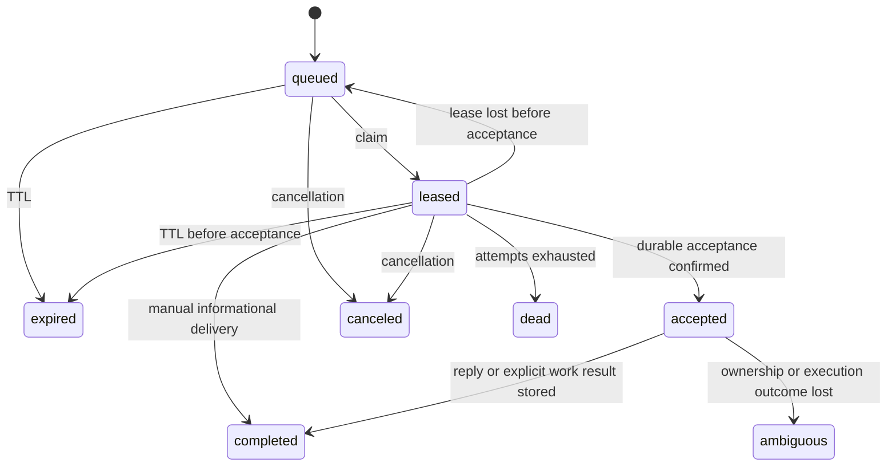

# Agent Messaging lifecycle audit — 2026-10-08

This audit covers the server, HTTP and local MCP interfaces, interactive native
receivers, detached workers, agent usability, and delivery recovery for Codex,
Claude and Grok. Changes are local on top of `708e2a0a`; wrapper version is
0.9.25. No production deployment, live fleet messaging, provider login/refresh,
or restart of existing native sessions was performed.

## Architecture and ownership

| Layer | Responsibility and reviewed entry points |
| --- | --- |
| Session identity | `agent-session-work.ts`, `agent-messaging/session.ts`, `bindings.ts`: stable addresses, native-session continuity, scoped bridge bearer, current binding generation and one native writer. |
| API and eligibility | `routes/agent-messaging/`, `routes/agent-receiver.ts`, `agent-messaging/eligibility.ts`: host/engine/fleet policy, bridge and relay credentials, participant and chair authorization, request validation. |
| Durable bus | `agent-messaging.ts`, `task-execution.ts`: encrypted payloads, FIFO delivery, claim/lease fencing, confirmed acceptance, immutable result receipts and explicit recovery. |
| Receive health | `agent-receiver.ts`, `receiver-state.ts`, `agent-presence.ts`: native connection generation, source membership, heartbeat freshness and derived presence. A normal wrapper heartbeat cannot manufacture receive readiness. |
| Native runtime | `wrappers/cxx/internal/agentbus/receiver.go`, `native_queue.go`, `grok_queue.go`, `agentportal/`: protected Unix broker, exact native identity, queue admission and correlated peer/Portal replies. |
| Detached execution | `agentbus/worker.go`, `task_result.go`, provider adapters: supervised native resume, process ownership, bounded output, lease renewal, native stop/error parsing and result persistence. |
| Coordination | `call.ts`, `conference.ts`, `groups.ts`, `stall.go`: PINs, chaired rounds, budgets/deadlines, opt-in audiences and bounded call-silence notices. |
| Operator and agent UX | Local 26-tool MCP catalog, managed instructions, metadata-only admin views, explicit audited content reveal, native doctor and the in-app manual. |

Managed native `codex`, `claude` and `grok` entries and wrapper personas
`cdx`, `clx`, `cgx` converge on the same connection lifecycle. Provider binaries
retain their native grammar and execution/approval ownership.

## Native methods

| Engine | Interactive reception | Detached work |
| --- | --- | --- |
| Codex | App Server WebSocket over a private Unix socket; experimental initialization; exact loaded thread identity; `thread/queue/add`. Admission requires both native submission ID and matching `clientUserMessageId`. The native TUI schedules execution. | Wrapper-supervised `exec resume --json` for a saved thread, or `exec --json` for an authorized new identity. |
| Claude | Native MCP Channel notifications from the per-launch plugin; SessionStart identity; matched silent MCP ping proves both pipes before readiness and on heartbeats. | Wrapper-supervised native resume/print mode with JSON results. |
| Grok | Invocation-owned leader, passive framed ACP connection, SessionStart UUID, native roster/activity checks and `session/prompt` with stable prompt metadata. Correlated queue/update events establish admission. | Wrapper-supervised `--no-leader --output-format json`, with exact `--resume` identity when present. |

No receiver synthesizes keystrokes, runs a second native scheduler, or answers
native approval requests. MCP installation, native queue admission, transport
health and an actual model reply are separate pieces of evidence.

The Codex 0.161.0 experimental JSON schema was regenerated locally; its
`QueuedSubmission` requires `id`, `clientUserMessageId` and `input`, matching
the adapter checks. Public reference contracts were also inspected:
[Codex App Server](https://learn.chatgpt.com/docs/app-server),
[Claude Channels](https://code.claude.com/docs/en/channels-reference), and
[Grok headless/ACP](https://docs.x.ai/build/cli/headless-scripting).
The experimental Codex queue methods still require installed-binary schema
verification rather than relying solely on the public App Server page.

## Complete delivery lifecycle

1. A host-authenticated lifecycle registers an eligible engine and address;
   bridge credentials remain behind the wrapper's private broker. Resume binds
   the original native session with a generation fence. Concurrent native
   writers cannot share a binding.
2. Discovery returns eligible identities and derived presence, without message
   bodies. Direct sends use sender-scoped retry IDs; publications snapshot only
   opted-in eligible recipients. A queue receipt confirms persistence.
3. The current receiver or detached worker claims one target delivery. Claims
   have 60-second leases, renewed every 20 seconds; target FIFO and binding
   generations fence competitors. Queue TTL defaults to 24 hours with a
   60-second to seven-day range and a maximum of 12 delivery attempts.
4. Automatic native delivery and v2 work require confirmed durable acceptance
   before exposing content or starting execution. A lost acceptance response
   is retried using the same claim. An expired, unaccepted message cannot start.
5. Native queue admission is correlated to that message. Peer and Portal
   sources share a receiver but keep their own authorization and availability.
   A held delivery prevents another from being silently injected over it.
6. A substantive peer reply uses `agent_reply`; a Portal instruction uses
   `agent_receiver_reply`. Informational peer messages may finish through one
   `agent_listen` without an acknowledgement loop. V2 work must report
   `succeeded`, `failed`, `blocked` or `unknown` with a summary and optional
   evidence; transport completion alone is not success.
7. Result persistence retains the accepted lease after the native child exits.
   A lost storage response retries the same body and claim. It never reruns
   native work to recover a missing result acknowledgement.
8. An expired pre-acceptance lease can retry within its TTL/attempt budget.
   Losing an accepted lease becomes `ambiguous`, with no automatic replay.
   Cancellation revokes delivery authority; it does not undo completed effects
   or guarantee immediate interruption of interactive native work.
9. Finish, host removal, engine suspension, address disable and fleet shutdown
   fence the appropriate bindings and deliveries. Peer-bus shutdown preserves
   a separately enabled Portal connection. Re-enabling peer messaging requires
   a fresh lifecycle binding.
10. Recovery preserves transcript continuity. Ordinary missing transcripts
    require a one-use operator grant for a fresh start; schedules never use a
    fresh-session fallback. Persistent schedule recovery requires explicit
    opt-in and a progress timeout, with bounded retries/backoff when configured.

`completed` is a delivery state. The separately stored work result determines
the reported task outcome. `succeeded` remains an agent report, with evidence
references for review rather than an independent guarantee of correctness.

## Defects repaired

| Finding | Correction and regression evidence |
| --- | --- |
| Grok `sessionId` fallback ran before decoding JSON, so native camelCase identity was discarded. | Apply fallback after decoding; test snake_case, camelCase and precedence. |
| Claude advertised readiness before its first matched ping; startup assigned an artificial pong timestamp. | Require a real current ping before registration; regression proves no model turn is used. |
| Disabling peer messaging detached its address and then broke Portal heartbeat/reconnect through a shared binding check. | Prune disabled source membership and check peer binding only for a peer source; reproduce and verify for all three engines. |
| Server publications disappeared from mailbox rings because Server has no host row. | Left join host metadata; test Server identity with null FQDN and no leaked message body. |
| A full page of recently expired messages hid current waiting messages. | Order current queued messages first; reproduce with 20 missed calls followed by a new message. |
| Work could be accepted after its queue TTL if maintenance had not run. | Check expiry inside acceptance; already accepted work keeps its separate completion lifecycle. |
| `agent_request` hid a successful send when the subsequent wait failed. | Return `sent`, `result`, `wait_error` and recovery guidance; resume waiting on the original conversation. |
| Local send/request tools replaced caller retry IDs; call setup could not recover after consuming its PIN. | Preserve optional UUIDs and expose generated IDs on uncertain errors; replay the original call hello before PIN lookup, with changed-content conflict checks. |
| A worker stopped renewing when the native child exited even while storing/retrying its result. | Renew through completion storage, retry the same result after a lost response, and stop on definitive storage authentication/claim errors. Tests cover slow storage and a completed row rejecting renewal before the lost response is recovered. |
| Wrong-source reply errors gave no route to recovery. A native Codex trace used the Portal tool for a peer message and stopped. | Identify the correct reply tool only for a locally owned delivery; keep the source boundary and make no network request on the misrouted call. |
| Tool/manual text told automatic receivers to poll, described all deliveries as unaccepted and promised cancellation would kill every task. | Align descriptions and operator documentation with automatic reception, v2 results and native cancellation limits; retain explicit peer trust boundaries in work prompts. |
| Two existing CLI surface tests still scanned `run()` after dispatch moved to `runMode()`. | Follow the current shared dispatch function; both baseline failures now pass. |

The call retry ID identifies the original hello even after PIN expiry/reuse;
new calls require new IDs. No schema migration is needed for these repairs.

## Verification collected in this audit

| Check | Result |
| --- | --- |
| API `npm run typecheck`, `npm run lint`, `npm run build` | Passed. Lint retains existing warnings; no errors. |
| API `npm test -- --reporter=dot` | 333 files passed; 4,030 tests passed; 401 DB-dependent cases skipped in this run. |
| Disposable MySQL 8.4 baseline and migration runner | 249 baseline statements and 44 migrations applied to the isolated test database. |
| API `npm run test:db` | All 90 integration files and 1,086 tests passed, including the database-dependent cases. Counts overlap the ordinary API run and are not additive. |
| Go `go test ./...`, `go vet ./...`, `go build ./...` | Passed after the final wrapper changes. |
| Go race tests | Passed for `agentbus`, `agentportal`, `codex`, `claude`, `grok`. |
| Frontend `npm run check` | Svelte: zero errors/warnings; all 915 frontend tests passed. Manual content is served directly from the committed article. |
| Release packaging | 0.9.25 cross-built for Linux/macOS on amd64/arm64; manifest and publishing fixtures passed. No artifact was published. |

The integration coverage includes every one of the nine source/target engine
pairs, participant/chair authorization, receiver generations and policy changes,
calls/PIN expiry, conferences/draining/deadlines/budgets, opt-in publications,
encrypted work outcomes and idempotency, one-use fresh-start grants, schedule
recovery, portal operations and queue starvation/pool behavior.

Native canaries use temporary homes, brokers and conversations with access-only
credentials. Both peer and Portal challenges require exact correlated MCP
replies, then repeat after a forced receiver generation change in the same
native conversation; stopping the broker must report `unavailable`.

| Native CLI | Final artifact result |
| --- | --- |
| Codex 0.161.0 | Passed: both sources, correlated replies before/after reconnect, offline broker unavailable. |
| Claude Code 2.1.293 | Passed: both sources, correlated replies before/after reconnect, offline broker unavailable. |
| Grok 1.0.46 | Passed: both sources, correlated replies before/after reconnect, offline broker unavailable. |

Grok's final canary completed in 42.28 seconds with 14 ms ACP admission; its
external-access credential generation transitions 17 → 18 → 19 also passed
without a provider refresh grant. The final Codex run passed after adding the
source-specific reply guidance. This does not imply deterministic model behavior.

The final development wrapper tested by these canaries has SHA-256
`30c49dbb9fac0265f7c8332845b384e6576a97b59bc5edce9bab5fa00750310e`.
The separately built Linux amd64 0.9.25 release artifact is
`b8e9b226c0c7135d804d99ae4d83f1e35f9e27b8319aac64130f2a47bd48e9bf`;
release metadata differs from the development canary artifact.

Earlier failures are retained as evidence: targeted regressions failed before
their fixes; the first Grok fixture omitted native identity metadata from its
access-only projection and was rejected with `Authentication required` before
any model turn. Preserving that metadata while omitting refresh credentials
resolved the fixture. Codex had reply timeouts; a captured native transcript
showed the wrong reply-tool selection described above. Model behavior remains
nondeterministic; queue acceptance by itself must never be reported as a reply.

Local command logs are `/tmp/messaging-audit-*-20261008.log`; temporary build and
schema artifacts are under `/tmp/cxx-messaging-audit-20261008/`. These are local
diagnostics, not durable production evidence or a source of credentials.

## Delivery and remaining boundaries

The implementation continues to use native methods for all three engines.
Real model canaries and database tests establish separate adapter and server
proofs; they do not establish an arbitrary task's correctness or a deployed
fleet-wide end-to-end matrix. Linux native execution was tested; macOS and arm64
artifacts were cross-compiled without native runtime testing on those platforms.
Existing esbuild target/deprecation and lint warnings were not expanded into
unrelated dependency changes.

Rollout requires the API changes followed by wrapper 0.9.25; existing receiver
processes need a new launch to load the fixes and tool guidance. No database
change is required. A rollback can restore the previous API and wrapper
artifacts without a data migration. Verification ran on the uncommitted worktree;
source delivery is recorded in Git. Production was not published or restarted.
